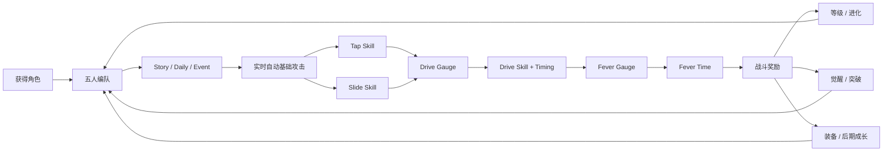
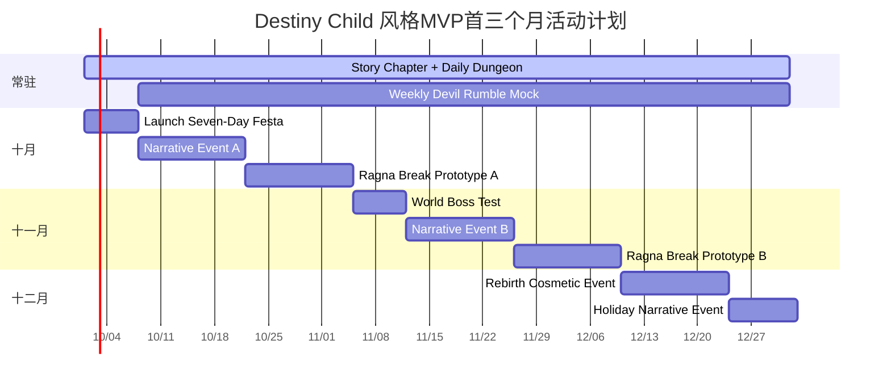
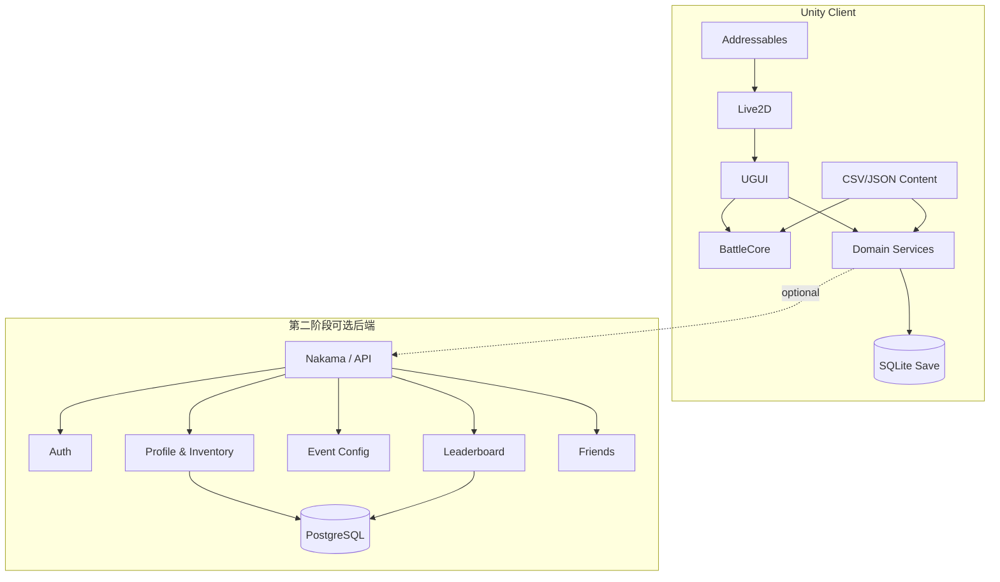

# 《Destiny Child（天命之子）》非商业怀旧复刻：全系统拆解、开发规格与MVP实施报告

## 执行摘要与研究边界

《Destiny Child》是一款由韩国 SHIFT UP 主导开发、以**高质量角色插画 + Live2D 动态立绘 + 五人半即时战斗 + 重角色收集养成 + 周期性活动**为核心的移动端收集型 RPG。早期韩国资料将它定义为“叙事型 CCG（Narrative CCG）”；同期系统已经包含约 300 名 Child、剧情世界地图、Event Dungeon、Underground、Devil Rumble、Live2D 鉴赏和全语音剧情等模块。后续全球服进一步加入 Ragna Break、World Boss、Narrative Dungeon、Re:Birth Labyrinth、Soul Carta、Ignition、Endless Duel 等大量中后期系统。citeturn19view0turn18view2turn21search3

游戏于 **2023 年 9 月 21 日结束在线运营**。SHIFT UP 随后将客户端更新为 Memorial Version，使原玩家能够基于停服前生成的验证码和账户数据继续查看角色插画等内容。这意味着今天若要恢复“可玩版”，不能简单依赖 Memorial 客户端，而需要重新实现战斗、成长、掉落、经济和活动逻辑。citeturn20view0

原作 Live2D 技术可以得到非常强的一手确认：Live2D 官方 Showcase 明确将《Destiny Child》列为 **Cubism 2** 项目，使用 Cubism Editor 与 Cubism SDK。同期采访也显示，采用 Live2D 的核心目的正是保留高精度二维插画本身，而不是把角色重新转译成普通 3D 或传统序列帧动画。citeturn20view1turn8search1

**本报告的最重要结论是：不要以“完整复制停服前的全部 Destiny Child”作为第一阶段目标。** 原作停服时公开二手资料统计的角色规模已经超过 500，且经历约七年运营后拥有巨量活动、剧情、装备、Soul Carta、皮肤、语音、Live2D 动作和后期成长系统；若全部重制，仅 500 个角色的原创替代立绘和 Live2D 制作就可能达到数万工时。citeturn21search9

真正应该首先复制的是它的“**感觉**”：

> **精美动态角色收藏 → 五人队伍配置 → 自动基础攻击 → Tap / Slide 手动决策 → Drive 爆发 → Fever 爽感窗口 → 获得角色/素材 → 等级、进化、觉醒、突破、装备 → 更高难度剧情与活动。**

这个闭环在 2016 年韩服早期资料里已经基本成型，而且恰恰是最能代表《Destiny Child》的部分。citeturn19view0turn19view1turn19view2

因此本报告推荐的个人怀旧项目不是“换皮抽卡 RPG”，而是一个**Clean-room 式精神复刻**：

| 项目 | 推荐方案 |
|---|---|
| 平台 | iOS / Android，优先 Android APK |
| 引擎 | Unity 6.3 LTS + URP |
| 动画 | 新制作模型使用当前 Live2D Cubism；低预算可改 Unity 2D Animation |
| 方向 | 玩法复刻、表现致敬，IP资产彻底原创 |
| MVP角色 | 12 名原创角色，覆盖 5 属性、5 战斗职业 |
| 队伍 | 5 人 |
| 主线 | 1 Chapter、12 战斗关 |
| 成长 | Level / Evolution / Awakening / Uncap / Equipment |
| 战斗 | Auto Attack + Tap + Slide + Drive + Fever |
| PVE | Story + 3 类 Daily Dungeon + 1 个 Narrative Event |
| 抽卡 | 本地模拟，无真实货币 |
| 后端 | MVP 不需要服务器 |
| PvP / Ragna / WB | 第二阶段 |
| 原作美术、音频、模型 | **不随项目发布、不打包、不重新分发** |
| 完整开发量 | 约 2,000–2,300 人时；多人并行约 12–16 周 |
| 垂直切片 | 5 角色版本约 650–850 人时 |

### 研究中的关键假设

| 标记 | 假设 |
|---|---|
| **A1** | 原作完整服务器源代码、最终版战斗公式和数据库结构没有公开，因此本报告不会把推测伪装成“原始公式”。 |
| **A2** | 本报告中注明“原作”的数字来自同期指南、官方页面或玩家实测；版本不同可能存在差异。 |
| **A3** | 本报告提供的 Damage、EXP、掉率、经济数值属于**可直接用于 MVP 的重建值**，并非声称已经反编译出原作公式。 |
| **A4** | 原作精确 UI 内部参考分辨率没有找到足够可靠的一手资料，因此 1080×1920 等属于本项目制作规范，不属于原作事实。 |
| **A5** | MVP 无商业支付、无公开抽卡付费、默认单机运行。 |
| **A6** | “复刻”指机制与体验研究，不意味着使用原作角色、美术、声音、Logo、文案或客户端资源。 |

证据强度上，本报告优先采用 SHIFT UP/Google Play、Live2D、Com2uS 等第一方来源；再采用韩国 Inven、Inven Global 等运营同期资料；最后才使用玩家 Wiki、Reddit 和 GitHub 逆向项目来补足已经无法从官方停服站点确认的细节。值得注意的是，社区工具已经能够读取原客户端中的角色基础属性、技能、Ignition 技能版本和 Buff/Debuff 数据，同时存在针对 `.pck` 文件的处理工具；这些资料对理解数据结构很有价值，但不等于原始资产可以合法再发布。citeturn20view3turn20view4

## 原作的完整系统与玩法拆解

**产品定位与核心体验。** 早期《Destiny Child》不是传统“每回合选技能”的 RPG，而是一种介于自动战斗和实时技能调度之间的系统：五名角色持续自动基础攻击，当技能蓄力后，玩家通过角色头像进行 Tap 或向上 Slide，再围绕全队 Drive Gauge 选择爆发时机，最终进入 Fever Time。专业媒体同期资料明确描述了自动基础攻击、手动普通技能、Slide、Drive、弱点攻击、Critical、自动战斗与加速等操作。citeturn19view1turn19view2



**叙事设定本身服务于角色收集。** 早期设定围绕一个生活窘迫、在人界打工的恶魔主人公被卷入魔王争夺战展开，Child 则成为玩家队伍和人物剧情的主体。它不是先做一条单纯 RPG 主线再附加抽卡，而是让“每个可收集角色拥有故事、对话、好感/觉醒剧情和外观变化”成为收藏价值的一部分。早期资料甚至把 Affection 升级与角色台词、个人剧情和 S 等级服装直接绑定。citeturn19view0turn19view1

### 美术与视觉语言

原作的最大识别资产不是战斗复杂度，而是**极高密度的二维角色美术**。Live2D 官方目前仍保留《Destiny Child》项目 Showcase，并明确记录为 Cubism 2 项目。原作商店页面也仍将其归类为 Stylized、Anime，保留大量游戏截图。citeturn20view0turn20view1

通过官方/同期截图进行视觉分析，可以把原作视觉语法概括为：

| 维度 | 原作特征 | 复刻时真正需要保留的“感觉” |
|---|---|---|
| 人物比例 | 高挑、曲线夸张、强时装感 | 明确人物剪影和强人体曲线，不照搬具体造型 |
| 线稿 | 精细、偏漫画插画 | 干净外轮廓 + 大量服装细节 |
| 上色 | 高饱和局部色 + 大面积暗调 | 暗背景突出人物 |
| 材质 | 皮革、金属、薄纱、蕾丝、珠宝等混搭 | 材质反差要强 |
| 光影 | 强高光、局部霓虹/边缘光 | 强调“夜世界”氛围 |
| UI底色 | 黑、深紫、灰黑 | `#0E0D16` 一类低亮底色 |
| 强调色 | 紫、品红、金、白 | 功能状态与稀有度色分离 |
| 卡面 | 角色占画面绝对主体 | UI避免挡人物 |
| 动态 | 不是大幅角色跑跳，而是插画“活起来” | 呼吸、发丝、服装、胸腔、表情、视差 |
| 成人感 | 原作存在性感和部分裸露表达 | 根据项目发布范围主动降低风险 |

目前 Google Play 页面仍将 Memorial App 标为 Mature 17+，并列出 Violence、Blood、Partial Nudity；因此“性感角色美术”本身就是原作产品识别的一部分，但它同时会影响年龄分级和公开发布范围。citeturn20view0

原作 **Live2D 的关键不是动作多，而是分层够细**。为了让一个静态插画产生“活着”的感觉，最重要的是眼睛、瞳孔、嘴、脸部角度、头发前中后层、胸腔、肩、手臂、衣物飘动、饰品摆动和前后景视差；实际上不需要把它做成完整 2D 横版动作游戏。

社区存档项目中还出现了 Destiny Child `.pck` 工具以及 Spine Viewer，但这只能说明原客户端资产生态中存在相应格式研究/查看需求；**核心 Child 展示使用 Live2D 是官方可以确认的，而不能因此进一步推断“所有角色动画都是 Spine”。** citeturn20view1turn20view4

### UI与交互

早期韩服主页本身就是一个高度信息密集的 LiveOps Hub：顶部账号和货币、左上活动与任务、右上设置与角色相册、中部角色/内容入口、底部导航共同构成主界面。citeturn19view0

战斗 UI 则高度稳定：顶部是敌人状态、关卡进度和敌方 Drive 信息，中间为战场，底部是五名角色头像/技能状态；点击角色发动普通技能，向上滑发动 Slide；另有己方 Drive Gauge、全队 HP、时间、速度、暂停和 Auto Skill。citeturn19view1turn19view2

这也是复刻时最应该保留的 UI 空间关系，而不是复刻按钮贴图本身。

### 属性、职业与队伍

原作有 **Fire、Water、Wood、Light、Dark 五属性**。Fire/Water/Wood 形成循环克制，Light 与 Dark 相互克制。韩服早期资料明确记录这一体系。citeturn19view2

早期资料把 Child 分为攻击、防御、回复、妨害、辅助以及经验/进化素材型等七种类型；在全球版实际战斗语境中，五个主要职业可以归纳为：

| 职业 | 英文 | 核心任务 | 常见队伍位置 |
|---|---|---|---|
| 攻击型 | Attacker | 单体/多段伤害、爆发 | 主输出 |
| 防御型 | Defender | Taunt、Barrier、减伤 | 前线 |
| 妨害型 | Debuffer | Poison、Bleed、Stun、DEF Down 等 | 控制 |
| 回复型 | Healer | 即时治疗、持续恢复 | 生存 |
| 辅助型 | Supporter | ATK、Skill Charge、速度等 Buff | 节奏核心 |

全球服资料也使用 Attacker、Defender、Debuffer、Healer、Supporter 这五类战斗角色分类。citeturn0search0

一个常规 Party 最多 **5 名 Child**，早期规则不允许同名角色重复上阵；队伍还拥有 Leader 选择和多套编队槽位。citeturn19view1

### 战斗机制

原作的战斗必须理解为“**实时充能制**”而不是回合制。

基础攻击自动发生。技能准备完成后，玩家可以点头像使用 Normal/Tap Skill；对头像进行按压并向上滑动则使用更强的 Slide Skill。Slide 通常拥有更高伤害，或者多目标、回复、Buff 等更复杂效果。citeturn19view2

攻击和技能逐渐积累 Drive Gauge。Drive 可用后由玩家选择角色释放对应的 Drive Skill，随后会出现 Timing Gauge；早期韩服资料明确记载，Timing 成功时 Drive 最多可达到 **150%** 的效果/伤害。citeturn19view2

Drive 同时推动 Fever：

| Drive Timing | 早期韩服 Fever 增量 |
|---|---:|
| BAD | 8% |
| GOOD | 15% |
| GREAT | 30% |
| PERFECT | 40% |

达到 100% 时进入 Fever。早期韩服资料记载 Fever 持续 **7 秒**；全球服社区 Wiki 后来又记录了 Fever 最多 70 hits、Fever hit 基于 Tap Skill 单次伤害的一部分计算，因此可以确定该系统在不同服务器/版本阶段经历过调整。citeturn19view3turn17search3

这也意味着**不应把任何一个社区时期的 Fever 数字当作七年生命周期中永远不变的绝对规则**。

Buff/Debuff 同样是战斗的核心，而不仅仅是“加攻击减防御”。全球服社区长期总结指出，许多同类 Buff/Debuff 不允许无限叠加，并存在来源优先级；常见规则为 Drive 级效果覆盖 Slide、Slide 覆盖 Tap，而部分 DOT/持续回复有特殊叠加规则。citeturn17search3

因此从工程角度看，正确实现方式不是给每个角色写一堆 `if`，而是：

`Effect → StackGroup → Priority → Duration → TargetRule → DispelRule`

这会直接决定后续增加 100 个角色时系统是否崩溃。

### 基础属性与成长

全球版早期资料通常使用五项主要战斗属性：

| 属性 | 功能 |
|---|---|
| HP | 生存总量 |
| ATK | 攻击能力，并参与部分治疗计算 |
| DEF | 减少受到的伤害 |
| AGL | 与命中、回避、Debuff 命中/抵抗相关 |
| CRT | Critical 触发概率 |

同期指南还特别指出 CRT 主要影响暴击出现概率，而不是单纯代表“暴击伤害数值”。citeturn3search8

原生星级早期覆盖 **1★–5★**，但所有 Child 可以继续成长到 **6★**。citeturn19view0

等级成长可通过战斗获得经验，也可吞噬其他 Child；同属性材料曾有 10% 额外经验，并存在 120%/150%/200% 的随机强化倍率。citeturn19view0

Evolution 的重要特点是：

> 满级 → 消耗同星级素材 Child 和进化宝石 → 星级 +1 → 最大等级提高 → 等级重新变成 1。

例如早期资料明确记录 3★→4★ 需要 3 个 3★素材 Child。citeturn19view0

Uncap/Limit Break 则消耗同一角色的重复副本，不仅提高属性，也提高技能 Tier；后期全球服玩家资料普遍以 `+6` 为完整 Uncap，并需要角色本体之外的 6 个额外副本。citeturn19view0turn18view3

原作没有传统 MMO 那种分支式“技能树”。单个战斗 Child 的主要战斗能力可以理解为：

**Basic/Auto → Tap/Normal → Slide → Drive → Leader**

而角色成长通过技能等级、Uncap Tier，以及后期 Ignition 改变技能效果。社区客户端工具甚至可以读取普通和 Ignited 技能版本及其 Buff/Debuff 定义，这为这种数据驱动结构提供了很强的旁证。citeturn20view3

Affection/Awakening 是极具《Destiny Child》辨识度的成长层。角色从 E 开始，以 Onyx 提升至 S；Onyx 可以通过分解不需要的 Child 获得。随着 Affection 提高，不只提高战斗属性，还会解锁角色台词、个人剧情，最终 S 等级还可获得外观。citeturn19view1

这说明它实际上把：

**数值成长 + 人物剧情 + 收藏反馈 + 外观奖励**

绑定在同一系统里。这一点比单纯把角色“升到 Lv.60”更值得复刻。

### 装备及后期成长层

基础装备有三大类：

| 槽位 | 原作典型属性 |
|---|---|
| Weapon | ATK，并附带 CRT、AGL 等攻击相关能力 |
| Armor | HP、DEF |
| Accessory | 从上述多个属性类型中组合 |

这些内容可以从早期韩服装备指南得到确认。citeturn19view1

后期运营又继续增加装备 Craft Option、Soul Carta、Ignition Core 等纵向系统。2020 年更新报道已经明确提到 World Boss、Magic Mirror Shop 以及装备 Craft System；社区后期资料则大量围绕 Amplified ATK/DEF/AGL/CRT 的 Ignition Core 配置展开。citeturn12search7turn17search5

因此这里特别需要纠正一个容易产生的误解：

> **Destiny Child 的核心并不存在一套类似《暗黑》六槽符文的基础 Rune 系统。**

如果你复刻时再额外加“六格符文”，反而会让产品越来越不像 Destiny Child。更接近原作的路线是：

`基础三件装备 → 装备词条 → Soul Carta → Ignition Core`

但后三者都不应该放进第一版 MVP。

### PVE、PVP和运营内容全貌

经过多年更新，原作内容可以按下面的层级理解。早期 Story、Event Dungeon、Underground、Devil Rumble、Exploration 的基本规则来自同期韩服/全球版资料；后续 Narrative、Ragna、World Boss、Rebirth、Endless Duel 等来自各时期更新和玩家资料。citeturn19view3turn18view2turn2search18turn12search7turn21search3

| 系统 | 类型 | 核心机制 | 主要产出 | MVP |
|---|---|---|---|---|
| Episode / World Map | PVE | 主线关卡 | EXP、Gold、装备、角色/素材 | **必须** |
| Event Dungeon | 日常 PVE | 星期轮换资源副本 | EXP、Evolution Gem、Gold | **必须** |
| Underground | Roguelite PVE | 连续多场、HP继承、阵亡禁用 | 装备、Gold、Onyx、Stamina | P1 |
| Exploration | 离线养成 | 派遣 1/3/6/12h | EXP、进化素材 | P1 |
| Devil Rumble | 异步 PVP | 对其他玩家编队、积分排名 | 排名奖励、商店币 | P2 |
| Ragna Break | Raid PVE | 逐级 Boss、共享 HP、好友协力 | Ragna Coin、5★等奖励 | P2 |
| Narrative Dungeon | 活动 PVE | 剧情关 + 活动货币 + Boost Child | 活动角色/装备/资源 | **MVP活动模板** |
| World Boss Trial | 大编队 Boss | 最多 20 Child 队伍 | Magic Mirror Fragment | P2 |
| Re:Birth Labyrinth | 高难日常 | 多阶段高难 PVE | 外观/专属奖励 | P2 |
| House of Reincarnation | 重复角色系统 | 已拥有角色进一步获取副本 | Uncap相关 | P2 |
| Endless Duel / Engarde | 后期 PVP | 多队/规则型竞技 | 周期竞技奖励 | P3 |
| Hecate's Library / Replay | 剧情归档 | 重看故事 | 收藏 | P1 |
| Spa / Hot Spring | 收藏养成 | 角色展示/亲密型内容 | 收藏反馈 | P2 |
| Soul Carta | 收藏装备 | 卡面/属性构筑 | Build差异 | P2 |
| Ignition | 终局成长 | Core + 强化技能 | 终局数值 | P3 |
| Spacewalk / Puppets | 停服前后期系统 | 进一步扩充终局内容 | 高端成长 | 不建议复刻首批 |

Event Dungeon 在全球早期资料中按星期切换素材、EXP 和 Gold，材料 Dungeon 还可以把低阶 Evolution Gem 合成为高阶；这是非常典型的日常资源漏斗。citeturn18view2

Underground 则非常值得研究。全球版资料记录其有 15 场战斗、每三胜获得奖励，而且角色 HP、Drive Gauge 会继承到下一场；死亡角色当日无法继续使用。这使“拥有更多能用的角色”第一次从收藏行为变成战略资源。citeturn18view2

Devil Rumble 并非双方实时联网操作，而是异步对战，胜利后增加积分并进入排行，同时有每日任务、段位奖励和专属商店。citeturn19view3

Ragna Break 是原作最有代表性的活动之一。典型赛季使用五人队挑战 Raid Boss，Boss 可从低等级逐步上升至 Lv.40；Boss HP 在挑战间持续存在，并允许其他玩家/好友加入攻击，通过伤害获得 Ragna Coin 和活动商店奖励。具体 Ticket 数和赛季长度在运营过程中有过变化，因此应把这些参数放入 Event Config，而不是写死在程序里。citeturn2search18turn2search14

World Boss 则把队伍规模进一步提升到 **20 Child**，让长期积累的大量角色真正产生用途；2020 年报道还明确记录了 Magic Mirror Fragment 和对应商店。citeturn12search7

Narrative Dungeon 更接近传统两周剧情活动：新剧情、Normal/Hard、活动货币、Boost Child 和奖励进度共同构成循环。社区长期记录的活动中也存在 Boost Child 提高活动货币收益的机制。citeturn12search2

联动活动通常不是独立重新开发玩法，而是复用这套架构：例如 BlazBlue 联动曾加入新的 5★ Child、Soul Carta、Pickup Summon 与 Narrative Dungeon。citeturn2search19

这恰恰是 Destiny Child 长期运营的真正技术秘诀之一：

> **系统很少，但数据配置很多。**

Story、Narrative、Raid、WB、PvP 的角色、敌人、掉落、Banner、商店、Boost、Mission 都应当是配置驱动，而不是每次活动重新写程序。

### 抽卡与经济系统

晚期全球服玩家记录中，Crystal Banner 常见 **5★总概率 3%**，10 连价格为 **2700 Crystals**；同时曾存在每日一次的 6% Banner、角色保证 Banner、Pickup Banner 和其他特殊池。某些新角色保证池通过 Mission Pass 在最多 15 次十连后给予目标角色。citeturn18view3

在独立概率为 3% 的假设下，一次十连至少出现一名 5★的概率为：

\[
1-(1-0.03)^{10}\approx 26.26\%
\]

需要特别指出的是，2016 韩服首发阶段曾爆发召唤概率披露争议：媒体报道指出对外宣传的 5★概率与直接抽取实际概率存在定义差异，Mileage 被计入宣传口径，运营方随后道歉并处理补偿。这是复刻经济系统时最不应该复制的部分。citeturn8search9

原作的核心经济资源可概括如下：

| 资源 | 核心用途 |
|---|---|
| Gold | 强化、进化、装备及后期系统 |
| Crystal | Summon、部分次数/体力恢复 |
| Onyx | Awakening、后期技能相关消耗 |
| Stamina | Story等常规战斗 |
| Evolution Gem | 角色进化 |
| Blood Gem | 稀有特殊商店/获取途径 |
| Dungeon Coin | 世界地图商店 |
| Rumble Coin | PVP商店 |
| Ragna Coin | Raid活动商店 |
| Magic Mirror Fragment | World Boss商店 |
| Narrative Token | Narrative活动 |
| Summon Ticket | 免费/活动召唤 |

不同地区和运营阶段具体名称、用途和兑换比例发生过调整；其中 Dungeon Coin、Ragna/WB 等模式专属货币都能从同期内容资料得到佐证。citeturn19view3turn2search18turn12search7

### 社交功能

《Destiny Child》的社交设计并不依赖 MMORPG 式的大型公会。全球版 Story 允许好友 Child 在空位时加入队伍，并增加额外 Leader Buff；Ragna 又把好友协力扩展到共享 Raid Boss。citeturn18view2turn2search18

Devil Rumble 和 World Boss/Ragna 排名进一步提供异步竞争。也就是说，其核心社交关系实际上是：

**好友借用 → Raid 协力 → 排名比较**

本次研究没有找到足够可靠的资料证明“传统公会/Clan”曾是全球服的核心基础功能，因此**MVP 不应该为了看起来像手游而凭空增加公会**。

## 美术资产、动画与UI制作规格

从开发成本看，《Destiny Child》最昂贵的不是代码，而是角色资产。早期约 300 Child、停服时二手资料统计超过 500 的规模意味着，完整角色资源复建几乎必然成为整个项目最大瓶颈。citeturn19view0turn21search9

所以建议建立两个资产等级。

**Hero Asset** 用于主要可玩角色，全 Live2D；**Mob Asset** 用于敌方杂兵，用简化骨骼/静态图加轻微动画即可。

### MVP资产预算

| 类型 | 数量 | 单体资源要求 | 总量 |
|---|---:|---|---:|
| 可玩角色 | 12 | 全身插画 + Live2D | 12 |
| 剧情NPC | 3 | 半身+基础表情 | 3 |
| 普通敌人基础型 | 6 | 简化立绘/骨骼 | 6 |
| 敌人变体 | 12 | 换色+局部件 | 12 |
| Boss | 3 | 独立高质量资产 | 3 |
| 主界面背景 | 1 | 竖屏 | 1 |
| 剧情背景 | 5 | 竖屏/可横向裁切 | 5 |
| 战斗背景 | 4 | 2–3层视差 | 4 |
| Summon背景 | 1 | 动态特效 | 1 |
| Event背景 | 2 | 活动KV拆分 | 2 |
| 通用战斗VFX | 20–25 | 元素/治疗/Buff等 | ~24 |
| 技能Icon | 35–40 | 128/256px | ~40 |
| 物品Icon | 40 | 素材/装备/货币 | 40 |
| 通用UI Icon | 80–120 | 功能与状态 | ~100 |
| BGM | 5 | Home/Battle/Boss/Event/Summon | 5 |
| SFX | 35–50 | UI + Battle | ~45 |

### 角色原画源文件规范

**推荐值，不代表原作内部规格：**

| 项目 | 推荐 |
|---|---|
| Canvas | 3500×6000 px 起 |
| 色彩 | sRGB |
| 格式 | PSD/PSB分层源文件 |
| 游戏纹理 | PNG/WebP或引擎压缩纹理 |
| Live2D Atlas | 普通角色 2048²；主角/高细节可 4096² |
| Portrait预览 | 1024×1024 |
| Card图 | 768×1024 |
| 头像 | 512×512 |
| Skill Icon源文件 | 512×512，运行时降到128/256 |
| UI基准画布 | 1080×1920 |
| 适配 | Unity Canvas Scaler + runtime SafeArea |
| 输出透明边缘 | 至少保留 8–16px padding |

目前 Live2D 官方仍提供 Cubism SDK for Unity；当前 SDK 文档也提供 Unity 侧模型集成和性能测试工具，因此新项目没有必要继续锁死原作的 Cubism 2 格式，应使用当前 Cubism 制作全新的原创模型。citeturn15search1turn15search5turn15search9

### Live2D切分规范

一个主要角色至少拆分：

`Face_Base`

`Brow_L / Brow_R`

`EyeWhite_L / EyeWhite_R`

`Iris_L / Iris_R`

`UpperLid / LowerLid`

`Mouth_Closed / Mouth_Inside / Teeth / Tongue`

`Hair_Back / Hair_Mid / Hair_Front`

`Neck`

`Torso`

`Chest`

`UpperArm_L/R`

`Forearm_L/R`

`Hand_L/R`

`Hip / Leg`

`Cloth_Front / Cloth_Back`

`Accessory_01...`

`Weapon_Front / Weapon_Back`

`Shadow / Highlight`

不要把完整头发做成一张；至少拆为前、中、后和几束独立长发。

**MVP参数建议：**

| 参数组 | 参数 |
|---|---|
| Head | Angle X/Y/Z |
| Face | Eye Open、Eye Smile、Brow、Mouth Form/Open |
| Body | Body Angle X/Y/Z |
| Breathing | Breath |
| Hair | Hair X/Y、Physics |
| Clothing | Cloth Swing |
| Accessories | Accessory Swing |
| Touch | Face/Body Reaction |
| Battle | Damage、SkillPrep、Drive |
| Story | Emotion Blend |

### 每角色动画清单

MVP 不需要几十段角色动画。12 角色统一：

| Motion | 必须 |
|---|---|
| Idle_A | ✓ |
| Idle_B | ✓ |
| Blink/Look | 参数自动 |
| Home_Touch_A | ✓ |
| Home_Touch_B | ✓ |
| Skill_Tap | ✓ |
| Skill_Slide | ✓ |
| Drive | ✓ |
| Hit | ✓ |
| Victory | ✓ |
| Defeat | ✓ |
| Story Emotion | 通过参数混合 |

也就是说，**每角色约 9 个明确 Motion + 一组参数动画**已经足够制造强烈的 Destiny Child 感。

如果预算非常有限，最先削减的是 `Idle_B`、Victory 和独立 Defeat，而不是削掉脸部和头发 Physics。

### 视觉差异化方案

为了避免变成原作角色的“AI重画”，建议保留以下抽象风格：

**保留：**

“都市恶魔/超自然时尚”“高细节成年角色”“暗背景”“高饱和局部色”“二维动态插画”“霓虹+奢华材质”。

**必须改变：**

原作角色脸型、发型组合、服装轮廓、Logo、星级框、属性图标、召唤动画、世界观名词、角色名字、剧情设定、UI图形资产。

推荐自己的 MVP 调色板：

| 用途 | HEX |
|---|---|
| Background 0 | `#0D0D14` |
| Background 1 | `#181522` |
| Purple | `#6D45A7` |
| Magenta | `#C848BA` |
| Gold | `#D9B96B` |
| Cyan | `#5BC7D9` |
| Danger | `#D85969` |
| Text | `#F2F1F5` |
| Text Secondary | `#A6A1B1` |

这些是本项目的原创 UI 色板建议，不是对原作截图做取色复制。

### UI布局样例

| 页面 | 顶部 | 中部 | 底部 | 核心交互 |
|---|---|---|---|---|
| Home | Lv、昵称、Gold/Crystal/Stamina | Live2D主角色、活动入口 | Home/Child/Battle/Summon/Menu | Touch角色、进入内容 |
| Child List | Filter、Sort、容量 | 3–4列Card Grid | Level/Evolve/Awake | 长按详情 |
| Child Detail | 名称、星级、属性/职业 | Live2D | Stats/Skill/Gear/Awake | Swipe切角色 |
| Party | Party Preset | 5角色槽 | Roster | Drag/Auto Formation |
| Story Map | Chapter | Stage节点 | Difficulty | 选择关卡 |
| Battle | Enemy HP、Timer、Pause | 战场 | 5角色头像+Drive | Tap/Slide/Drive |
| Summon | Currency | Banner KV | 1×/10× | Summon |
| Narrative | Event Time/Currency | Story/Stages | Shop/Mission | Farm |
| Inventory | Capacity/Filter | Grid | Sell/Enhance | 批量操作 |
| Gallery | Character Filter | 大型Live2D | Costume/Story | 收藏鉴赏 |

主页布局应借鉴原作“中心人物 + 周围功能 + 底部主导航”的信息结构，而不要照着截图像素复刻。原作早期主页结构和战斗布局已经有同期指南完整描述。citeturn19view0turn19view1

## MVP功能范围、核心公式与可直接开发的初始数值

这里最重要的原则是：

> **先做出“5个人在屏幕上自动攻击，头像充能后 Tap/Slide，Drive Timing 后进入 Fever”这一分钟，其他所有系统后做。**

如果这一分钟不对，再完整的抽卡、角色仓库和后台都没有意义。

### MVP范围

| 模块 | 优先级 | MVP状态 | 实现重点 |
|---|---|---|---|
| BattleCore | P0 | 完整 | 5v5实时状态机 |
| Auto Attack | P0 | 完整 | 独立攻击计时 |
| Tap Skill | P0 | 完整 | 单击角色头像 |
| Slide Skill | P0 | 完整 | Hold+Swipe Up |
| Drive | P0 | 完整 | 全队共享Gauge |
| Drive QTE | P0 | 完整 | Timing判定 |
| Fever | P0 | 完整 | 7秒/70hit兼容模型 |
| Element | P0 | 完整 | 5属性 |
| 5 Classes | P0 | 完整 | 12角色覆盖 |
| Buff/Debuff | P0 | 核心20种 | 数据驱动 |
| Story | P0 | 12关 | 一个Chapter |
| Character Level | P0 | 完整 | Lv1–60 |
| Evolution | P0 | 3★–6★ | 满级进化 |
| Uncap | P0 | +0–+6 | Duplicate |
| Awakening | P0 | E–S | Onyx |
| Equipment | P0 | 3槽 | Weapon/Armor/Accessory |
| Summon | P0 | 模拟 | 无支付 |
| Economy | P0 | 核心货币 | 本地 |
| Save | P0 | 完整 | SQLite/JSON |
| Narrative Event | P1 | 1个 | 活动token |
| Daily Dungeon | P1 | 3类 | EXP/Evo/Gold |
| Gallery | P1 | 基础 | Live2D鉴赏 |
| Underground | P1 | 简版 | 9战连续 |
| Exploration | P1 | 简版 | 1/3/6h |
| Ragna | P2 | 不进首版 | Boss共享HP |
| Devil Rumble | P2 | 不进首版 | 需后端 |
| World Boss | P2 | 不进首版 | 20人 |
| Rebirth | P2 | 不进首版 | Cosmetic |
| Soul Carta | P2 | 不进首版 | Build扩展 |
| Ignition | P3 | 不进首版 | Endgame |
| Guild | 不做 | — | 非原作核心 |

### 战斗数学模型

下面全部属于 **MVP重建公式**。

设：

- `A` = ATK
- `D` = 目标 DEF
- `C` = Skill Coefficient
- `P` = Flat Skill Power
- `E` = Element Multiplier
- `Q` = Critical Multiplier
- `B` = Buff/Debuff Multiplier
- `V` = 0.95–1.05 Random Variance

基础防御减伤：

\[
M_{DEF}=\frac{1200}{1200+D}
\]

最终伤害：

\[
Damage=
\max
\left(
1,
round[(A\times C+P)\times
M_{DEF}\times E\times Q\times B\times V]
\right)
\]

这套公式的优势是 DEF 永远有收益但不会达到 100% 减伤。

**属性克制：**

| 关系 | E |
|---|---:|
| 优势 | 1.25 |
| 中立 | 1.00 |
| 劣势 | 0.85 |
| Light→Dark | 1.25 |
| Dark→Light | 1.25 |

原作确认的是属性克制关系本身；这里的 1.25/0.85 是 MVP 平衡值，并非声称是原始倍率。原作属性关系参见同期韩服资料。citeturn19view2

**暴击概率：**

\[
P_{crit}=
clamp
\left[
0.05+
\frac{CRT}{CRT+3200}\times0.40
+CritBuff,
0.05,
0.65
\right]
\]

Critical Damage：

\[
Q=1.50
\]

**Debuff命中：**

\[
P_{debuff}=
clamp
\left[
0.78+
\frac{AGL_{attacker}-AGL_{target}}{5000}
+AccuracyModifier,
0.55,
0.95
\right]
\]

这样就能让 AGL 同时服务于 Debuffer 和抵抗构筑，符合原作 AGL 作为命中/回避相关属性的设计方向。citeturn3search8

### Buff体系

建议所有状态表使用：

```text
effect_id
effect_group
effect_type
source_tier
value_type
value
duration
max_stack
target_rule
dispel_rule
```

其中：

```text
source_tier:
Tap   = 1
Slide = 2
Drive = 3
```

同 `effect_group` 默认由高 Tier 覆盖低 Tier。这个模型正好可以模拟原作社区长期总结的 Drive > Slide > Tap 类优先关系，而不需要针对每个技能写硬编码。citeturn17search3

### Skill Charge与操作

每个角色拥有独立 `skillCharge`：

\[
ChargePerSecond=
\frac{100}{BaseChargeTime}\times(1+ChargeSpeedBuff)
\]

推荐：

| Class | BaseChargeTime |
|---|---:|
| Attacker | 9.0 s |
| Defender | 8.5 s |
| Debuffer | 8.0 s |
| Healer | 9.0 s |
| Supporter | 7.5 s |

Skill Ready 时：

`Tap → 使用 Tap Skill → Charge=0`

`Hold + SwipeUp → Slide Skill → Charge=0`

原作早期资料要求角色按压约一段时间并上滑发动 Slide。为了移动端手感，可把 MVP 的 Hold Detection 做成 0.35s，但保留明显的“上滑释放”动作；如果追求严格怀旧模式，则提供 0.8–1.0s 选项。原始操作概念有同期资料佐证。citeturn19view2

### Drive与Fever

MVP：

```text
Tap       +6 Drive
Slide     +14 Drive
DriveMax  100
```

Drive QTE：

| Timing | Damage | Fever |
|---|---:|---:|
| Bad | ×0.90 | +8 |
| Good | ×1.00 | +15 |
| Great | ×1.20 | +30 |
| Perfect | ×1.50 | +40 |

Fever：

```text
Duration = 7.0 sec
MaxHits = 70
PerHitDamage = 60% × 单次Tap基础伤害
```

这里把早期韩服确认的 7 秒与 8/15/30/40 Fever 增量，以及全球社区后期记录的 70 hit / Tap-based Fever 结合为一个“兼容式怀旧规则”。citeturn19view3turn17search3

### Level公式

推荐：

\[
EXP_{next}(L)
=
round(80+28L^{1.55})
\]

示例：

| Level | 下一等级EXP | 累计EXP |
|---:|---:|---:|
| 1 | 108 | 0 |
| 10 | 1,073 | 4,132 |
| 20 | 2,989 | 22,901 |
| 30 | 5,534 | 63,780 |
| 40 | 8,598 | 132,510 |
| 50 | 12,118 | 233,976 |
| 60 | MAX | 372,524 |

星级与等级上限：

| 星级 | Level Cap | Evolution素材 | Gold | Evo Gem |
|---:|---:|---:|---:|---:|
| 3★ | 30 | 3×3★ | 10,000 | 10 |
| 4★ | 40 | 4×4★ | 30,000 | 25 |
| 5★ | 50 | 5×5★ | 80,000 | 50 |
| 6★ | 60 | — | — | — |

“当前星数个同星素材”沿用了早期原作进化逻辑；Gold/Gem 数字属于 MVP 平衡值。citeturn19view0

### 属性成长公式

\[
Stat(L)=
round
\left[
BaseStat\times EvoMultiplier
\times
\left(
1+
Growth\times
\left(\frac{L-1}{L_{max}-1}\right)^{1.08}
\right)
\right]
\]

Growth：

| Stat | Growth |
|---|---:|
| HP | 1.30 |
| ATK | 1.10 |
| DEF | 1.10 |
| AGL | 0.65 |
| CRT | 0.65 |

Evolution：

| Grade | Multiplier |
|---:|---:|
| 3★ | 0.82 |
| 4★ | 0.92 |
| 5★ | 1.00 |
| 6★ | 1.12 |

以 MVP 角色 `C001 焰刃` 为例：

| Lv | HP | ATK | DEF | AGL | CRT |
|---:|---:|---:|---:|---:|---:|
| 1 | 2,300 | 1,180 | 650 | 920 | 800 |
| 10 | 2,780 | 1,388 | 765 | 1,016 | 883 |
| 20 | 3,375 | 1,647 | 907 | 1,135 | 987 |
| 30 | 3,997 | 1,917 | 1,056 | 1,259 | 1,095 |
| 40 | 4,637 | 2,194 | 1,209 | 1,387 | 1,206 |
| 50 | 5,290 | 2,478 | 1,365 | 1,518 | 1,320 |
| 6★ Lv60 | 5,925 | 2,775 | 1,529 | 1,700 | 1,478 |

### Awakening数值

保留原作 E→S 结构。原作可以确认 Onyx 和阶段奖励机制，但下面费用是 MVP 值。citeturn19view1

| Rank | Onyx | 累计属性Bonus | 内容 |
|---|---:|---:|---|
| E | 0 | 0% | 初始 |
| D | 150 | 2% | 新台词 |
| C | 400 | 4% | Profile |
| B | 850 | 7% | 新互动 |
| A | 1,500 | 10% | Side Story |
| S | 2,400 | 15% | Costume |

### Uncap

```text
Max Uncap = +6
每次：
Base Stat +2%
Skill Level Cap +2
```

因此 +6 时为：

```text
Base Stat +12%
Skill Level Cap +12
```

原作 Uncap 确实依赖同角色副本并提升属性与技能 Tier；+6 是全球服后期典型完全突破状态。citeturn19view0turn18view3

### 技能模板

| Role | Tap | Slide | Drive |
|---|---|---|---|
| Attacker | 0.90×ATK+120 | 1.65×ATK+260，1–2目标 | 2.90×ATK+500，3目标 |
| Defender | 0.65×ATK+80 + Shield | Taunt + DEF+25% | Team Barrier |
| Debuffer | 0.70×ATK+90 + DOT | 1.10×ATK+160 + DEF−20% | 3目标Debuff |
| Healer | 最低HP Heal | 2目标Heal | 全体Heal+Regen |
| Supporter | 单体Charge+ | Team ATK+/Charge+ | Team Burst Buff |

治疗：

\[
Heal=ATK\times C+FlatHeal+MaxHP\times H
\]

比如 Healer Slide：

```text
2 lowest-HP allies
Heal = ATK × 0.65 + 350 + TargetMaxHP × 0.08
```

### MVP角色初始CSV

```csv
id,name,element,role,native_star,hp,atk,def,agl,crt,charge_time
C001,焰刃,Fire,Attacker,5,2300,1180,650,920,800,9.0
C002,炉心卫士,Fire,Defender,5,3400,720,1180,640,500,8.5
C003,潮汐祭司,Water,Healer,5,2900,900,820,780,650,9.0
C004,深蓝咒师,Water,Debuffer,5,2550,870,760,1080,680,8.0
C005,森语引路者,Wood,Supporter,5,2750,800,850,1020,600,7.5
C006,荆棘猎手,Wood,Attacker,5,2250,1120,690,980,850,9.0
C007,白昼守望,Light,Defender,5,3250,760,1120,700,530,8.5
C008,晨星歌者,Light,Supporter,5,2680,830,820,1060,620,7.5
C009,夜幕医师,Dark,Healer,5,2850,920,800,820,680,9.0
C010,影缚者,Dark,Debuffer,5,2500,900,730,1120,700,8.0
C011,灼红侍从,Fire,Attacker,4,2050,980,610,840,720,9.0
C012,冰镜使者,Water,Supporter,4,2400,720,760,900,560,7.5
```

### 推荐战斗力公式

仅用于关卡推荐，不参与真实战斗：

\[
CP=
round(
HP\times0.25+
ATK\times1.8+
DEF\times1.3+
AGL\times0.8+
CRT\times0.7+
SkillScore
)
\]

这样避免“战斗力”本身反向成为伤害变量。

### Story首章初始关卡表

| Stage | Stamina | 推荐Party CP | Child EXP | Account EXP | Gold |
|---|---:|---:|---:|---:|---:|
| 1-1 | 5 | 20,000 | 220 | 30 | 1,200 |
| 1-2 | 5 | 22,000 | 240 | 32 | 1,300 |
| 1-3 | 5 | 24,500 | 265 | 35 | 1,450 |
| 1-4 Boss | 5 | 28,000 | 320 | 45 | 1,800 |
| 1-5 | 6 | 30,000 | 300 | 40 | 1,650 |
| 1-6 | 6 | 33,000 | 325 | 43 | 1,800 |
| 1-7 | 6 | 36,500 | 350 | 46 | 1,950 |
| 1-8 Boss | 6 | 40,000 | 420 | 58 | 2,400 |
| 1-9 | 7 | 43,000 | 380 | 52 | 2,200 |
| 1-10 | 7 | 47,000 | 410 | 55 | 2,400 |
| 1-11 | 7 | 52,000 | 450 | 60 | 2,650 |
| 1-12 Boss | 7 | 60,000 | 560 | 75 | 3,400 |

每次通关固定 Gold，再从 DropGroup 抽一次：

| Drop | Normal | Boss |
|---|---:|---:|
| EXP Material | 25% | 20% |
| Evolution Gem I | 25% | 20% |
| Common Gear | 20% | 25% |
| Onyx Fragment | 15% | 15% |
| 3★ Fodder/Ticket Fragment | 5% | 10% |
| Rare Evo Gem | 0% | 5% |
| Empty | 10% | 5% |

Boss 首通额外：

```text
1-4  = 200 Crystal
1-8  = 200 Crystal
1-12 = 300 Crystal + 4★ Character Ticket
```

这组数值的目标不是模拟商业手游的漫长消耗，而是让一个怀旧 MVP 在 3–5 小时内完整展示一次：

`卡关 → 成长 → 进化 → 再挑战 → 获胜`

的反馈。

## 抽卡、经济平衡与首三个月活动蓝图

原作晚期全球服中，常见 Crystal Summon 的 5★率为 3%，2700 Crystal 十连；社区还记录有每日一次 6% 池、Pickup、目标角色保证池等多套 Banner。citeturn18view3

但你的项目是**无商业支付个人怀旧项目**，因此完全没有理由保留那些用于收入最大化的摩擦。

最好的做法不是删除抽卡，而是保留**抽卡的仪式感和收藏随机性**，删除金钱压力。

### 推荐MVP召唤方案

普通单抽：

| Rarity | Rate |
|---|---:|
| 5★ | 3% |
| 4★ | 17% |
| 3★ | 80% |

Event Pickup：

```text
Featured 5★ = 1.5%
Other 5★    = 1.5%
4★          = 17%
3★          = 80%
```

十连：

```text
Cost = 2700 Crystal
第10槽至少4★
```

保留“2700”只是为了让熟悉全球服的玩家获得数字记忆感；这不是必须保留的 IP 表达。晚期全球服玩家资料确实反复记录过这一十连成本。citeturn18view3

### Pity

推荐不要复制原作某些 Banner“提前抽到角色后 Banner 锁定，导致后续 Mission Pass 奖励无法继续拿”的奇怪行为。社区玩家曾明确描述这一机制造成“第14次十连才抽到反而很倒霉”的体验。citeturn18view3

MVP 改成：

```text
50 pulls without 5★:
Next pull = guaranteed 5★

80 event pulls without featured:
Next 5★ / next pull = Featured guaranteed

Pity counter visible at all times
Off-banner 5★ does NOT erase featured guarantee progress
```

更重要的是：

> **活动主角必须可以通过玩活动直接拿到一份。**

也就是随机抽卡负责“提前获得/额外副本”，而不是阻止玩家阅读活动角色剧情。

### 货币流

MVP 最好只保留六种核心资源：

| Currency | 每日/活动产出 | 消耗 | 目标 |
|---|---|---|---|
| Stamina | 自动回复+Daily | Story/Event | 控制Session |
| Gold | Story/Gold Dungeon | Level/Evolve/Gear | 常规Sink |
| Crystal | Mission/Event | Summon | 收藏 |
| Onyx | Dismantle/Event | Awakening/Skills | 废卡回收 |
| Evo Gem | Daily Dungeon | Evolution | 属性成长 |
| Event Token | Narrative | Event Shop | 周期目标 |

Stamina：

```text
Cap = 100
Regen = 1 / 10 min
每日自然恢复 = 144
Daily Mission = +40
```

平均 Stage 消耗 6–8，因此自然恢复约支撑 20–25 场普通战斗。

Crystal 周产出建议：

| 来源 | 周均 |
|---|---:|
| Daily Mission | 1,470 |
| Weekly Mission | 600 |
| Login | 330 |
| Challenge/PVP模拟奖励 | 300 |
| 基础合计 | 2,700 |
| 14日Narrative额外 | 2,700–5,400 |

因此普通周约 10 Pull；活动两周大约额外得到 10–20 Pull。

与此同时，Narrative 活动通过进度直接送活动角色，因此玩家不需要“80抽才有资格体验剧情”。

### 经济Sink建议

Gold：

```text
Level Up
Evolution
Equipment Enhancement
Crafting（P2）
```

Onyx：

```text
Awakening
Skill Level
```

Crystal：

```text
Summon为主
Stamina恢复只作为便利功能
不出售资源
```

明确**不做**：

“付费Crystal”“Paid-only Banner”“付费才能拿活动角色”“VIP”“有期限Paid Currency”“无限体力付费刷新”“概率口径不透明”。

尤其是概率口径必须把：

`单抽概率 / 保底 / Featured概率 / 第10槽规则 / Pity重置规则`

全部公开。原作早期的概率披露争议恰好证明，这个部分不能用模糊描述。citeturn8search9

### 活动模板

原作最成功的地方是使用少数框架快速换剧情、Boss、Banner 和奖励，而不是每两周发明一个新游戏。Ragna、Narrative、World Boss、Devil Rumble、Event Dungeon 等长期共存正是这种运营结构。citeturn18view2turn2search18turn12search7

| 活动 | 周期 | 规则 | 核心奖励 | 内部测试指标 |
|---|---|---|---|---|
| Narrative Story | 14天 | Normal/Hard+Token+Boost | 活动角色、Crystal、装备 | 参与率≥60%，剧情完成≥35% |
| Ragna Break | 14天 | Lv1→40 Boss、累计伤害 | 角色/装备/Ragna Coin | 3日回访≥50%参与者 |
| World Boss Trial | 7天 | 20角色队伍、Boss累计伤害 | Mirror Token | 老角色使用率提升30% |
| Devil Rumble Season | 每周 | 异步PVP、积分段位 | Crystal/Coin | 周参与≥40% |
| Daily Dungeon Rotation | 常驻 | EXP/Evo/Gold轮换 | 基础养成资源 | 日使用≥50%活跃玩家 |
| Seven-Day Festa | 7天 | 每日Mission | 4★/5★Ticket | D7目标≥20% |
| Rebirth Cosmetic Week | 14天 | 高难Labyrinth | Costume Token | 收藏页访问+25% |

这里的数字属于**内部原型目标**，不是声称为行业基准。

整个 MVP 邀请测试阶段建议看：

```text
D1 ≥ 40%
D7 ≥ 20%
D30 ≥ 8%
平均单次Session 15–30 min
Story Chapter完成率 ≥ 35%
至少一次Evolution完成率 ≥ 60%
至少一次Drive/Fever成功率 ≥ 90%
```

如果是个人怀旧项目，“留存”真正要验证的其实是：

> 玩家是否愿意在已经看过角色立绘之后，仍然回来玩第二次战斗。

### 首三个月活动时间线

以下仅为开发/内部测试示例，假设可玩版从 **2026-10-01** 开始测试：



真实开发第一版甚至不必真正实现 Ragna/WB。活动 Timeline 仍可保持这一结构，而暂时用“Challenge Boss”模拟。

## 技术架构、后端、开发工时与交付物

### 引擎选择

**首选 Unity 6.3 LTS。**

截至当前 Unity 官方文档已经列出 Unity 6.3 LTS（6000.3）；Unity 自身还有成熟的 Android/iOS 工具链和 Addressables。Addressables 可以按地址异步管理角色 Prefab、纹理和活动资源，Android 端还能与 Play Asset Delivery 集成。citeturn15search28turn15search0turn15search4

更关键的是 Live2D 官方直接提供 Cubism SDK for Unity。当前 Live2D 文档也正在把新版本 Unity 支持向 URP 迁移，因此从零开始的新项目推荐直接使用 URP，而不是为了模拟老游戏而采用过时渲染管线。citeturn15search1turn15search37

推荐：

```text
Unity 6.3 LTS
URP
UGUI（MVP）
Addressables
Live2D Cubism SDK
C#
SQLite / JSON
Git + LFS
```

**不推荐 Unreal**，不是它做不到，而是本项目绝大部分复杂度集中在 UI、数据表、Live2D 和移动端 2D 表现，使用 Unreal 没有明显收益。

**Godot**可以作为完全偏开源路线的备选，但如果追求 Destiny Child 式 Live2D 工作流，Unity 的现成集成链更直接。

### Client架构

建议把 BattleCore 做成纯 C#，尽量不直接依赖 MonoBehaviour：

```text
Presentation
 ├─ UGUI
 ├─ Live2D
 ├─ VFX
 └─ Audio

Application
 ├─ BattleController
 ├─ CharacterService
 ├─ InventoryService
 ├─ GachaService
 ├─ EconomyService
 └─ EventService

Domain
 ├─ BattleCore
 ├─ DamageCalculator
 ├─ EffectSystem
 ├─ TargetResolver
 ├─ GrowthSystem
 └─ DropResolver

Data
 ├─ CharacterDef
 ├─ SkillDef
 ├─ EffectDef
 ├─ StageDef
 ├─ DropDef
 ├─ BannerDef
 └─ EventDef

Persistence
 ├─ SQLite
 ├─ Save Migration
 └─ ContentVersion
```

BattleCore 用固定逻辑 Tick：

```text
Simulation = 30 Hz
Rendering = 60 FPS
```

输入不直接“调用技能”，而是写成 Command：

```text
UseTapSkill(unitId, tick)
UseSlideSkill(unitId, tick)
UseDriveSkill(unitId, tick)
Pause()
ChangeSpeed()
```

这样以后做 Replay、PVP验证、AI或自动测试都会非常容易。

### 状态机

```text
UnitState
Idle
 ↓
AutoAttack
 ↓
ChargingSkill
 ↓
SkillReady
 ├─ Tap
 └─ Slide
 ↓
ChargingSkill

PartyState
Normal
 ↓
DriveReady
 ↓
DriveQTE
 ↓
FeverCharge
 ↓
Fever
```

### 推荐数据表

`character_def`

```text
id
name_key
element
role
native_star
base_hp
base_atk
base_def
base_agl
base_crt
tap_skill_id
slide_skill_id
drive_skill_id
leader_skill_id
live2d_address
portrait_address
```

`skill_def`

```text
skill_id
skill_type
target_rule
hit_count
atk_coef
flat_power
drive_gain
effect_group_id
effect_value
duration
```

`effect_def`

```text
effect_id
effect_type
stack_group
source_priority
max_stack
duration_type
dispel_type
```

`stage_def`

```text
stage_id
chapter
difficulty
stamina
time_limit
enemy_wave_group
drop_group
child_exp
account_exp
gold
first_clear_reward
```

`banner_def`

```text
banner_id
start_at
end_at
currency
cost_1
cost_10
pool_id
featured_pool
pity_5star
pity_featured
```

如果以后联网，再增加：

```text
player_profile
player_unit
inventory_stack
wallet_ledger
gacha_history
battle_record
event_progress
ranking_record
friend_relation
```

其中 `wallet_ledger` 应采用追加式账本，而不是只存一个 Gold 数：

```text
ledger_id
player_id
currency
delta
balance_before
balance_after
reason
source_id
idempotency_key
created_at
```

### MVP技术关系图



### 为什么MVP不需要服务器

对个人单机怀旧版：

```text
角色
抽卡
Story
成长
Narrative
存档
```

全部都可以本地实现。

现在就写：

```text
Account Server
Auth
Leaderboard
Redis
Kubernetes
微服务
反作弊
```

只会延迟第一次可玩的时间。

当准备加入 Ragna、好友、Devil Rumble 时，再引入 Nakama 是合理的。Nakama 官方本身提供 Authentication、Friends、Storage、Leaderboard、Realtime 等游戏后端能力，Unity 示例也覆盖好友、Clan、Storage、Matchmaking、Leaderboard 等典型功能。citeturn15search2turn15search6turn15search18turn15search38

### 联网后的权威原则

真正联网时：

```text
客户端负责表现和输入
服务器负责：
- Currency mutation
- Gacha RNG
- Event reward
- Inventory mutation
- Ranking score
- PvP result validation
```

Battle Replay 保存：

```text
contentVersion
battleSeed
partySnapshot
enemySnapshot
inputCommands
finalHash
```

这样可以让服务器在必要时重演战斗，而不需要实时同步每个角色位置。

反作弊优先级：

```text
Server-authoritative wallet
Server-authoritative gacha
Server time
Signed content version
Request idempotency
Rate limit
Replay hash
```

单机版则完全没必要做复杂反作弊。

### 第三方服务

| 功能 | MVP | 联网版 |
|---|---|---|
| Login | Local UUID | Nakama / Apple / Google |
| Database | SQLite | PostgreSQL |
| Leaderboard | 无 | Nakama |
| Friends | 无 | Nakama |
| Remote Config | Local JSON | Server Config |
| Analytics | Local Event Log | Firebase Analytics 可选 |
| Push | 无 | FCM/APNs |
| Payment | **无** | 本项目仍建议无 |

Firebase 官方目前仍提供 Unity SDK、Analytics 和跨 Android/iOS 的 Firebase Cloud Messaging，因此若以后真的要做活动提醒，可以直接利用现有 Unity 集成，而不是自建 Push 服务。citeturn15search3turn15search7turn15search15turn15search11

### 开源/可替代工具

| 环节 | 首选 | 替代 |
|---|---|---|
| Engine | Unity | Godot |
| Character Animation | Live2D Cubism | Unity 2D Animation |
| Illustration | Photoshop/Clip Studio | Krita |
| Vector UI | Figma/Illustrator | Inkscape |
| Backend | Nakama | 自建 ASP.NET/Go |
| DB | SQLite/PostgreSQL | — |
| Version Control | Git LFS | Perforce |
| Sheet | Excel/Google Sheets | LibreOffice |
| Audio | Reaper | Audacity |
| VFX | Unity Particle/VFX | Sprite Sheet |

Unity 官方当前仍把 2D Animation 等包列入可用于正式生产的已发布包，因此对于背景 NPC 或 Mob，不一定需要每个单位都上 Live2D。citeturn15search32

社区 Destiny Child `.pck`、Live2D viewer、Spine viewer 项目适合用于**格式研究和历史考据**；不要把 GitHub 上存在提取工具误解成“原作资源变成了开源素材”。citeturn20view3turn20view4

### MVP开发工时

以 **12 可玩角色、全部原创美术、离线版**估算：

| 模块 | Client | Art | Backend | QA |
|---|---:|---:|---:|---:|
| 工程/Data Pipeline | 60h | 12h | 0 | 12h |
| Home/UI Navigation | 70h | 80h | 0 | 18h |
| Character/Party | 85h | 45h | 0 | 20h |
| BattleCore | 190h | 95h | 0 | 45h |
| VFX/Audio Integration | 55h | 80h | 0 | 20h |
| Growth/Equipment | 90h | 30h | 0 | 25h |
| Story/Stage/Drop | 75h | 45h | 0 | 20h |
| Gacha/Economy | 50h | 25h | 0 | 15h |
| Narrative Event | 55h | 30h | 0 | 15h |
| Save/Settings/Gallery | 45h | 15h | 0 | 15h |
| Live2D Pipeline + 12 Characters | 65h | 420–660h | 0 | 25h |
| Build/Optimization/CI | 45h | 0 | 0 | 20h |
| **合计** | **885h** | **877–1,117h** | **0h** | **250h** |

总计约：

**2,012–2,252 人时。**

这个估算已经明确把 Live2D 角色制作作为主要成本，而不是假设“程序做完就等于游戏做完”。

如果加入联网版：

| 模块 | Client | Backend | QA |
|---|---:|---:|---:|
| Nakama/Auth | 60h | 120h | 35h |
| Friends/Leaderboard | 45h | 75h | 20h |
| Devil Rumble | 80h | 100h | 30h |
| Remote Event Config | 35h | 60h | 15h |
| Server Economy | 30h | 80h | 25h |
| 合计追加 | 250h | 435h | 125h |

所以：

> **先联网会额外增加约 800 人时，而且对验证核心玩法几乎没有贡献。**

### 推荐团队

完整 MVP：

| 人员 | 数量 | 工作 |
|---|---:|---|
| Unity Client Engineer | 2 | Battle/UI/Data |
| Character Illustrator | 1 | 角色/Boss |
| Live2D + UI Technical Artist | 1 | Rig/UI/VFX |
| QA | 0.5 | Mobile/Balance |
| Game Designer/Data | 0.5 | 可由Lead兼任 |
| Backend | 0 | MVP无需 |

这种配置约 **12–16周**较合理。

如果是：

**1个程序员 + 外包角色美术/Live2D**

则更现实的是 **6–9个月**。

如果真正一个人从程序、插画到 Rig、UI 全做，2,000+ 人时意味着**12个月以上**比“三个月复刻完整游戏”现实得多。

### 垂直切片

不要一开始做 12 个角色。

第一阶段只做：

```text
5 Characters
1 Enemy Team
1 Boss
1 Background
Tap
Slide
Drive
Fever
Element
5 Classes
1 Battle Screen
```

验收条件：

```text
一场战斗 = 60–120 sec
可1×/2×速度
可Auto Basic
Tap操作可靠
Slide识别率 >95%
至少1次Drive
至少1次Fever
60 FPS目标
无GC Spike导致明显卡顿
同Seed+同Input可以得到同BattleResult
```

只要这个版本不好玩，**停止制作抽卡页面。**

### 推荐开发节奏

| 周期 | 目标 |
|---|---|
| Week 1 | BattleCore、1攻击者、1敌人 |
| Week 2 | 5角色、Tap/Slide |
| Week 3 | Drive、Fever、Buff/Debuff |
| Week 4 | Party、角色数据、Level |
| Week 5 | Evolution/Awakening/Uncap |
| Week 6 | Story、Drop、装备 |
| Week 7 | Home、Character UI |
| Week 8 | Summon、Economy |
| Week 9 | Narrative Event |
| Week 10 | Save/Gallery |
| Week 11 | 设备优化、UI Polish |
| Week 12 | Balance/Regression |

美术从 Week 1 平行进行，否则一定成为关键路径。

### 正式交付物

最终项目建议至少包含：

| Deliverable | 内容 |
|---|---|
| `GDD_DestinyStyle_v1.pdf` | 完整玩法设计 |
| `CombatSpec.pdf` | Tap/Slide/Drive/Fever |
| `Balance.xlsx` | Stats/EXP/Skills/Stages/Gacha |
| `CharacterDef.csv` | 角色数据库 |
| `SkillDef.csv` | 技能数据库 |
| `EffectDef.csv` | Buff/Debuff |
| `StageDef.csv` | 关卡 |
| `DropTable.csv` | 掉落 |
| `BannerDef.csv` | 抽卡 |
| `EventConfig.csv` | Narrative等 |
| `ArtBible.pdf` | 视觉与角色规范 |
| `Live2D_RigGuide.pdf` | 分层/参数/Motion |
| `UI_Wireframe.fig` | 页面原型 |
| `TDD.pdf` | 技术架构 |
| `DataSchema.sql` | 在线版结构 |
| `QA_TestCases.xlsx` | 功能/数值测试 |
| `IP_CleanRoom_Checklist.pdf` | IP资产检查 |
| Android APK | 最小可玩版本 |
| iOS工程 | iOS Build Project |
| Web Demo | 可选展示版本 |

## IP、隐私、发布风险与最终开发结论

这里必须把“**个人、非商业**”和“**没有版权风险**”彻底分开。

中国现行《著作权法》把复制、信息网络传播、改编等列为著作权人的专有权利；存在合理使用例外，但“我没有收费”本身并不是一个覆盖所有复制/改编行为的自动免责条款。citeturn16search0turn16search15turn16search24

所以风险从低到高大致是：

| 行为 | 风险 |
|---|---|
| 自己研究机制、不发布 | 很低 |
| 自己写代码模拟五人战斗 | 低 |
| 使用完全原创角色和UI | 低 |
| 私人设备使用原作截图作参考 | 相对低 |
| 发布“Destiny Child Remake”并使用Logo | 高 |
| 使用原角色名称+高度相似造型 | 高 |
| 分发原Live2D模型 | **极高** |
| 打包原客户端音频/BGM/语音 | **极高** |
| 发布原`.pck`提取资源 | **极高** |
| 用原角色训练专门模型后批量复现角色 | 高 |
| 提供完整原作素材下载器 | **极高** |

历史上金亨泰曾对个人二次创作表达过相对宽松的态度，但这种旧采访中的创作者态度**不能被视为今天有效的法律授权**。特别是现在 Destiny Child IP 并没有进入“无人管理”的状态：Com2uS 在 2026 年第一季度的官方投资者材料中仍列出了基于 **Destiny Child IP** 的移动 Idle RPG 项目，并将当前预计推出时间列为 2027 年。这说明该 IP 仍在现实商业授权和开发链条中。citeturn8search17turn7view0

因此最安全的技术路线是：

> **复制系统，不复制表达。**

具体改名：

| 原作概念 | Clean-room名称示例 |
|---|---|
| Child | Resonant / 契灵 |
| Devil | Candidate / 候选者 |
| Drive | Burst |
| Fever | Overdrive |
| Onyx | Echo Dust |
| Devil Rumble | Eclipse Arena |
| Ragna Break | Breach Raid |

五属性、五职业、自动攻击+点击技能之类的抽象设计思想可以作为参考，但角色、美术、图标、世界观文本、具体技能文案和 Logo 必须重新设计。

原作的社区逆向项目非常适合回答“一个 Skill 数据可能有哪些字段”“客户端包里怎样组织模型”等研究问题；但即使社区工具能读取 `.pck`、角色基础数值或 Live2D 数据，也不要把提取出来的原图、模型、声音加入公开仓库。citeturn20view3turn20view4

如果项目永远只在自己的设备上运行，实际暴露面明显低于公开发行；**一旦开始公开 GitHub Release、APK分享、App Store/TestFlight 外部发布或 Web 公网访问，就应重新进行权利审核。**

数据隐私方面，离线版反而有巨大优势：没有必要收手机号、身份证、联系人、定位、广告 ID 或行为画像。中国《个人信息保护法》明确规范个人信息处理活动，并要求处理具备合法基础、遵守必要性等规则；若以后面向公众提供联网服务，则必须重新审视账号、日志、分析、Push 和跨境 SDK 数据。citeturn16search1

如果处理不满十四周岁未成年人的个人信息，还存在更严格的要求；网络游戏面向公众运营时，也可能进一步涉及未成年人身份验证等监管要求。citeturn16search2

因此非商业 MVP 最优隐私架构就是：

```text
No Account
No Phone
No Advertising ID
No Contacts
No Location
No Payment
No Cloud Save

Local UUID
Local Save
Optional Crash Log only
```

这样几乎把绝大部分个人数据问题在架构层直接消掉。

### 最终建议的复刻边界

**第一阶段真正需要复刻的，是下面这一组：**

> Live2D角色  
> 5属性  
> 5职业  
> 5人队  
> Auto Attack  
> Tap  
> Slide  
> Drive Timing  
> Fever  
> Leader  
> Buff/Debuff  
> Level  
> Evolution  
> Awakening  
> Uncap  
> Weapon/Armor/Accessory  
> Story  
> Daily Dungeon  
> Summon  
> Narrative Event  
> Gallery

这已经能够恢复《Destiny Child》大约 **80% 的核心体验识别度**；这里的“80%”是产品判断，不是原作官方统计。

**第二阶段再加：**

> Underground → Exploration → Ragna Break → Devil Rumble → World Boss。

**第三阶段才考虑：**

> Soul Carta → Rebirth → House of Reincarnation → Ignition → Endless Duel → Spa → Spacewalk/Puppets 类终局模块。

这一顺序和原作七年运营自然形成的结构是一致的：早期已经存在五人战斗、角色成长、Event Dungeon、Underground 和 Devil Rumble，而 Raid、World Boss、Craft、Ignition 等都是后续不断叠加的纵向系统。citeturn19view0turn19view3turn12search7

### 如果由我亲自做这个项目

我不会从“把 Destiny Child 全部恢复出来”开始。

我会把项目内部名字先改成类似：

**Project Childlike / Project Resonance**

避免一开始就在代码、包名、GitHub 仓库和 UI 中大量使用原 IP 标识。

第一天只建立：

```text
Unity 6.3 LTS
Portrait 1080×1920 Reference
URP
BattleCore Assembly
CharacterDef.csv
SkillDef.csv
EffectDef.csv
```

然后只画五个非常粗糙的原创 Placeholder。

第一个目标不是首页，而是：

> **五个头像出现在屏幕底部。**

角色会自动攻击。

技能充满。

点头像——Tap。

长按上滑——Slide。

技能推动 Drive。

Drive 出现 Timing。

第三次 Perfect 左右进入 Fever。

屏幕开始连续爆数字。

**只做这一场战斗。**

在这场战斗没有“那个味道”之前，我不会做 Summon。

不会做服务器。

不会做排行榜。

不会做 Shop。

不会做 500 个角色数据库。

不会训练 Destiny Child 角色 LoRA。

不会开始提取并整理几 GB 原作资产。

不会搭完整 LiveOps 后台。

不会做公会。

不会做支付。

第一阶段的绝对目标是：

> **用 5 个原创角色，把 Destiny Child 最具有辨识度的 60–120 秒重新做出来。**

做到之后，再扩展成 12 个角色，让玩家可以：

`抽到 → 看Live2D → 编队 → 打关 → 升级 → 觉醒 → 进化 → 再打关 → Drive → Fever → 获得活动角色。`

这个闭环跑通以后，它就已经不是一个技术 Demo，而是一款真正可玩的 **Destiny Child 精神复刻 MVP**。

然后才按：

**Narrative → Underground → Ragna → World Boss → PvP**

一层一层恢复原作长期运营的深度。

从项目风险、开发量和怀旧价值三方面看，**这是我认为当前最值得执行的版本；没有必要继续扩大首版范围。先完成五角色 Battle Vertical Slice，再决定是否投入完整十二角色 MVP。**