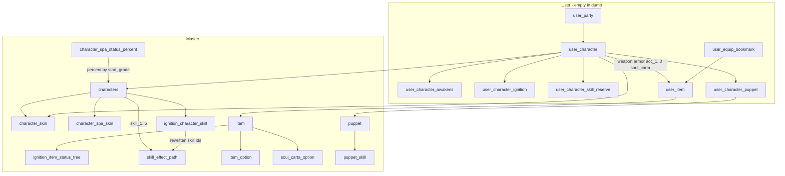
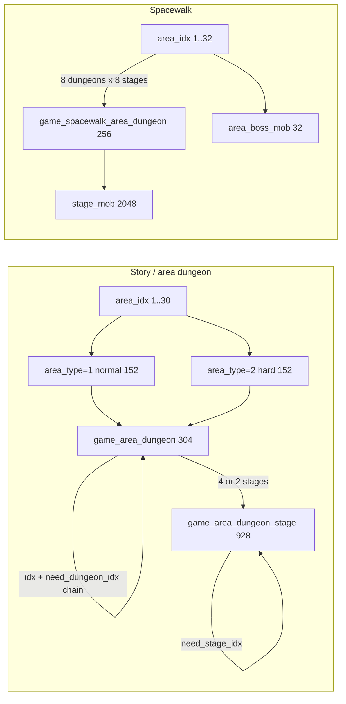

# Offline pack 1.1 — schema / entity graph

Source: Navicat dump `_sandbox/offline-pack-1.1/destinychild.sql` (MySQL 8.0.2, 20 Jul 2024, ~4.0 MB, 31 852 lines) plus `schema-only.sql` (~882 lines) and `application.yaml`. Parent inventory: `00-pack-inventory.md`. Clean-room field list: `docs/reference/mobile-archive/_drafts/DATA_MODEL_FROM_REFERENCE.md`.

This file is **reference only**. Copy **system grammar**, not rows. Do **not** copy original names, art, `view_idx` that resolve into `pck`, Unity `skill_effect_path` strings, or SQL into `F:\Resonance\client`. Do **not** run the private server, and do **not** import this dump into the shipped game.

Measurement: parse every `INSERT INTO` (30 518 rows, 28 of 54 tables). No `FOREIGN KEY` clauses exist — the graph below is **inferred** from column names and ID overlap. Original Korean `name` values were counted, not listed (at most ID examples).

---

## 1. Master vs user vs login

54 `CREATE TABLE`. **28 populated**, **26 empty**. Dump is a catalog + empty runtime save. `SET FOREIGN_KEY_CHECKS = 0`; PKs only.

| Layer | Tables | Rows in this dump | Role |
|---|---|---:|---|
| **Login / platform** | `do_platform_login`, `do_login`, `do_login_user` | **0 / 0 / 0** | Device uuid; wallet + account lv/exp; profile caps / nickname / tutorial / mileages |
| **Master / catalog** | 28 non-`user_*` except the three `do_*` | see §1.1 | Static defs the jar reads |
| **User / save** | 22 `user_*` | **all 0** | Runtime instances keyed by `nfguid` |

`character_awakens` is master-shaped but **0 rows**. Awaken **state** is on `user_character` / `user_character_awakens`.

`area_dungeon_clear` looks like **progress** (`is_clear`, `star_count`, `last_clear_stage_idx`) yet sits outside `user_*`. This dump has **1 leftover row** (`idx=1000`, `star_count=3`). Treat as a stray save fragment, not a third catalog.

Empty `user_*` still show `AUTO_INCREMENT` leftovers (e.g. `user_character` 11311, `user_item` 6751): Navicat exported schema after a wipe. Save was meant to live in MySQL at runtime — **not** a reason to import this file into Resonance.

### 1.1 Login columns (empty, grammar only)

| Table | PK | What it holds |
|---|---|---|
| `do_platform_login` | `id` | `device_name`, `install_session_id`, `uuid` |
| `do_login` | `nfguid` | `user_level`, `user_exp`, `gold`, `gem`, `blood_gem`, `friend_point`, `onyx`, `dungeon_coin`, `arena_coin`, `arena_trophy`, `skin_coin`, `raid_coin`, `spa_coin`, `world_boss_serial_coin` |
| `do_login_user` | `nfguid` | `nickname`, inventory/character caps, `tutorial_step`, `summon_mileage` / `arena_mileage` / `synthesis_mileage`, ticket daily buys, boost end dates, underground flags |

Resonance: **BAN** accounts, `nfguid`, gems, coins, mileage, IAP. Local `save.json` only.

### 1.2 User tables (empty schemas — instance grammar)

| Table | Instance of |
|---|---|
| `user_character` | Owned unit + 4–6 gear slots + affection + over_limit + 3 skill levels + awaken paths |
| `user_character_awakens` | Per `(nfguid, character_idx)` awaken + `ignition_level` |
| `user_character_ignition` | Per-unit hex cores (`ignition_slot`, `ignition_core`, `ignition_level`) |
| `user_character_skill_reserve` | 5× `reserve_N_skill_type` |
| `user_character_puppet` | Doll attached to `char_uid` |
| `user_item` | Item instance: enhance, over_limit, `plus_option_1..3`, stack `count`, `equip_character_uid` |
| `user_equip_bookmark` | 4-slot loadout: weapon / armor / `acc_1` / `soul_carta` |
| `user_party` | **5** `uid` + `leader_uid` |
| `user_chapter_boss_party` / `user_world_boss_party` | **20** `uid` + `drive_skill_slots` |
| `user_exploration` | 5-man dispatch timers |
| `user_spacewalk_area_dungeon` | Spacewalk clear cursor |
| `user_mail`, `user_home_*`, `user_spa_*`, `user_puppet_diorama`, `user_synthesis_character_list` | Mail / housing / spa / diorama / seasonal fuse — out of MVP |

### 1.3 Master tables (measured INSERT counts)

Populated counts **match** `00-pack-inventory.md` for every table it listed. Extra populated tables the inventory omitted are in **§6**.

| Table | Rows | Notes |
|---|---:|---|
| `characters` | 637 | Prefix split: **101=170**, **102=326**, **201=141** |
| `character_skin` | 1866 | `type` 0=1246, 1=620; **637** distinct `character_idx` |
| `character_spa_skin` | 488 | Same 488 as ignition roster; `view_idx` `scNNN_SS` |
| `character_spa_status_percent` | 240 | Affection % by `(attraction_level, start_grade)` |
| `character_awakens` | 0 | Schema only |
| `item` | 2952 | See §2.5 categories |
| `item_option` | 4406 | Affix pool (`type` 14=4244, 16=162) |
| `item_enhancement_status` | 60 | Enhance ladder +1…+15 columns |
| `item_over_limit_status` | 17 | `over_limit` 1–5 × a few `idx` |
| `ignition_character_skill` | 2928 | **488** chars × **6** nodes |
| `ignition_item_status_tree` | 3072 | **256** trees × **12** levels |
| `skill_effect_path` | 7257 | VFX path only; 5477 path=`none` |
| `puppet` / `puppet_skill` / `puppet_diorama` | 253 / 356 / 68 | All 253 puppets are also `item` `category=101001` |
| `soul_carta_enhancement_status` | 170 | 4 curves × enhance up to **50** |
| `soul_carta_option` | 1874 | 322 distinct `item_idx`; over_limit 0–5 |
| `game_area_dungeon` | 304 | 30 `area_idx`; `area_type` 1=152 / 2=152 |
| `game_area_dungeon_stage` | 928 | Chain + stamina + **3-chip** preview (not 5 filled) |
| `area_boss_mob` | 32 | Area-boss kit (skills `11`/`82`/`83`/`84`/`56`) |
| `chapter_boss_mob` | 10 | Chapter-boss kit + `hp_phase` |
| `game_spacewalk_area_dungeon` | 256 | 32 areas × 8 dungeons; `SUM(stage_count)=2048` |
| `game_spacewalk_area_dungeon_stage_mob` | 2048 | **5/5** `position_*_view_idx` filled |
| `game_spacewalk_area_boss_mob` | 32 | One boss row per spacewalk area |
| `special_raid_dungeon` | 67 | `season_idx` 0–56; yaml `raid: 49` present |
| `world_boss_serial_mob` | 74 | 38 seasons (yaml `world: 27` present) |
| `world_boss_serial_mob_data` | 38 | One row per WB season |
| `battle_type` | 84 | from→to matrix (PvP-ish) |
| `area_dungeon_clear` | 1 | Leftover progress row |

`application.yaml` seasons: `raid: 49` (comment 0–56), `world: 27` (1–38), `level_max: 1` (private-server auto-max-level cheat). Those are **server knobs**, not extra tables.

---

## 2. Entity graph — Character



Logical FKs (not declared):

| From | Column | To |
|---|---|---|
| `character_skin` | `character_idx` | `characters.idx` (0 orphans; 637/637) |
| `ignition_character_skill` | `character_idx` | `characters.idx` (0 orphans) |
| `characters` | `skill_1..5` | `skill_effect_path.idx` (**2170/2170** base ids present) |
| Ignition rewritten ids (9-digit) | skill_* | `skill_effect_path.idx` (**4001/4001**) |
| `user_character` | `idx` | `characters.idx` |
| `user_character` | `view_idx` / `spa_view_idx` | `character_skin.view_idx` / spa skin |
| `user_character` | `weapon` `armor` `acc_*` `soul_carta` | `user_item.uid` (instance), which points at `item.idx` |
| `item` | `ignition_tree_idx` | `ignition_item_status_tree.tree_idx` (256 items with a tree) |
| `item` category 8 | `idx` | `soul_carta_option.item_idx` (316/316 cat-8; 6 extra option keys) |
| `puppet.item_idx` | | `item.idx` (253/253) and `puppet_skill.idx` (356/356 refs) |
| `user_party.uid1..5` | | `user_character.uid` |

### 2.1 `characters` (637)

Five combat stats on the row: `hp`, `atk`, `def`, `agi`, `cri` (CRT). Plus `role`, `attribute`, `start_grade`, `skill_1..5`, `ignition_group`, `enable_awaken`, `awaken_group`.

| `idx` prefix | n | Hypothesis |
|---|---:|---|
| `101xxxxx` | 170 | Early playable roster (includes `10100001` protagonist) |
| `102xxxxx` | 326 | Later playable roster |
| `201xxxxx` | 141 | Enemy / NPC bodies (`view_idx` often `mNNN_SS`; roles 6–9 live only here) |

116 of 326 `102*` share the **same 5-digit suffix** as a `101*` row, but they are **not** evolved twins: same `role` only 25/116, same `attribute` only 29/116. Treat 101 vs 102 as **serial namespaces**, not a 1:1 evo FK.

`start_grade` (native star): 5=336, 4=85, 3=107, 2=57, 1=50, **6=2** (protagonist + one `201*`). `attribute` 1–5 is nearly even (117–139) — five elements, integers **unlabeled** in SQL (Memorial: 火/水/木/光/闇). `role` 1–5 are the combat five (179/114/56/115/135); roles **6–9** (25+5+5+3) are `201*` only.

`enable_awaken=2` on 598 rows (almost everyone). `ignition_group` is `0` on **149** rows = exactly the 149 characters **missing** from `ignition_character_skill` (111 of `201*` + 29 of `101*` + 9 of `102*`, including the all-zero-skill protagonist). Group codes track native star when present: `511`×312 with grade 5, `411`×77 with grade 4, `311`×99 with grade 3.

One row (`10100001`) has `skill_1..5 = 0`. Everyone else has five 8-digit skill ids.

### 2.2 Skin / wardrobe

`character_skin` PK `(idx, sub_type)`. **Every** `view_idx` matches `[cm]\d{3}_\d{2}` (1866/1866). Letter **`c`** = 1432 (playable-looking), **`m`** = 434 (monster-looking). Suffix **is** `sub_type` zero-padded (`sub_type=1` → `_01`).

| `type` | n | `sub_type` peak | Hypothesis |
|---|---:|---|---|
| **0** | 1246 | `1`=625, `2`=617 | Default body + second body (evo/devotion look) |
| **1** | 620 | `0`,`10`,`11`…, `87–89` | Extra wardrobe (event / paid / boss-ish `_88` `_89`) |

Skins per character: mostly 2 or 3 (276+212); max 10. `drive_skill_effect` is `none` on 1861/1866; five rows point at `drive/cNNN/drive_set` (VFX set, not a formula).

Spa overlay: `character_spa_skin` **488** rows, `view_idx` like `sc001_01` (not `cNNN`). Same 488 keys as ignition. **BAN** spa loop for Resonance; keep only as “affection has a presentation variant” grammar.

### 2.3 Skills (ids on the character; no `skill` table)

There is **no** `skill` / `skill_effect` numeric table. Combat verbs are five **slots** on `characters`:

| Slot | Memorial | Clean-room | ID prefix (playable) |
|---|---|---|---|
| `skill_1` | DEFAULT | `AUTO` | always **`11`** (636/636 non-zero) |
| `skill_2` | NORMAL | `TAP` | **`2` + `start_grade`** |
| `skill_3` | SLIDE | `SLIDE` | **`3` + `start_grade`** |
| `skill_4` | DRIVE | `DRIVE` | **`4` + `start_grade`** |
| `skill_5` | LEADER BUFF | `LEADER` | **`5` + `start_grade`** |

So the inventory’s `11 / 23 / 33 / 43 / 53` pattern is the **3★** special case (`start_grade=3`). 5★ units use `11 / 25 / 35 / 45 / 55` (338 TAP ids start with `25`; 336 rows are grade 5). Mismatch vs that rule: **2 rows**.

AUTO middle digits encode **element**: `skill_1[2:4]` is `0{attribute}` (e.g. attribute 1 → `1101…`). TAP/SLIDE/DRIVE/LEADER middle digits encode **role** in the last of that pair (role 1 skills cluster on `x1`, role 2 on `x2`, …).

Enemy/area-boss kits use a **different** family: AUTO still `11`, then `82` / `83` / `84`, last slot `56` (`area_boss_mob` 32/32). Those prefixes also dominate `skill_effect_path` (`82/83/84` ≈ 1100 rows).

`skill_effect_path`: **7257** `(idx → path string)`. Kinds: `none` 5477, slash paths 1327 (`buff/…`, `drive/…`), `sfx_*` 453 (`sfx_atk_normal`, `sfx_com_…`). **This is VFX addressing, not damage coefficients.** All playable base skill ids and all ignition rewritten ids resolve here. Formulas are **not in this dump** (jar / `pck` — do not decompile).

`user_character` stores only **`skill_1_level`, `skill_2_level`, `skill_3_level`** — three level tracks, not five. Matches Memorial LV 10/10 on TAP/SLIDE/DRIVE; AUTO and LEADER likely do not level independently.

`user_character_skill_reserve`: five `reserve_N_skill_type` ints → Memorial 技能預約 T/S/E tokens. Drive is not a token.

### 2.4 Ignition / awaken / over_limit / affection

**Two ignition layers** (Memorial hex `12/12` is the second):

| Layer | Table | Shape |
|---|---|---|
| Skill rewrite nodes | `ignition_character_skill` | 488 chars × levels **1,2,5,8,11,12** → `redstar` **1–6**. Level 1 copies all five skills; later levels overwrite **one** slot with a 9-digit variant (`{id}{n}`). |
| Hex / core tree | `ignition_item_status_tree` | 256 `tree_idx` × levels **1–12**. Stats `hp/atk/def/cri/agi` plus `amp_*`. `core_slot` 1=1536, 2=768, 3=768. |
| Save | `user_character_ignition` | `ignition_slot` + `ignition_core` item + `ignition_level` |

`redstar` 1–6 is the **6-node** strip (not 12). Item tree 1–12 is the **12/12** meter. Resonance already using a linear 0–12 scalar is closer to the tree than to the 6 skill nodes.

**Awaken:** master `character_awakens` is **empty**. Instance columns: `main_awaken`, `path_200_awaken` … `path_500_awaken`, `is_open_voice_true3`. Memorial **S CLASS / E CLASS** badge is this rank axis, **not** the heart meter.

**Affection (好感度):** `user_character.attraction_level` + `attraction_exp` + `bathing_hour`. Bonus table `character_spa_status_percent` has **exactly** 240 rows =

- `start_grade` 3 → **60** levels  
- `start_grade` 4 → **80** levels  
- `start_grade` 5 → **100** levels  

That matches Memorial caps 60 / 80 / 100. Values look like **×100 percents** (grade 5 at 100: hp=`3000` → 30.00%, atk/def/cri/agi=`2000` → 20.00%). **BAN** spa/bathing; **keep** the cap-by-star + percent-bonus grammar.

**Over-limit / uncap:** `user_character.over_limit` (varchar, no lookup table). Gear: `item.over_limit_status_idx` → `item_over_limit_status` (`over_limit` 1–5, values like 100/200/…500). Soul carta: `soul_carta_option` keyed by `(item_idx, over_limit 0–5)` — **six** steps. Memorial UI chip is `+6`. Product can keep `uncap` 0–6 as in DATA_MODEL; do not copy these value rows.

### 2.5 Equip (weapon, armor, acc, soul_carta)

Memorial shows **4 circles**: 武器 / 防具 / 裝飾品 / 魂之歌碑.

`user_character` instance columns:

| Column | Memorial slot | Extra |
|---|---|---|
| `weapon` | 武器 | |
| `armor` | 防具 | |
| `acc_1` | 裝飾品 | `is_open_acc_1` |
| `acc_2` / `acc_3` | **not shown** as extra circles | `is_open_acc_2` / `is_open_acc_3` — unlock ladder |
| `soul_carta` | 魂之歌碑 | `is_open_soul_carta` |

`user_equip_bookmark` is the **4-slot** subset (weapon / armor / `acc_1` / `soul_carta`) — same as Memorial. Resonance already models 4 slots; **BAN** `acc_2`/`acc_3` as product scope.

`item.category` vs combat stats / view prefix:

| category | n | Combat stats | `idx` first digit (majority) | `view_idx` | Slot hypothesis |
|---|---:|---|---|---|---|
| **1** | 589 | ATK-heavy (585 atk≠0) | `1` | `w*` | Weapon |
| **2** | 539 | HP/DEF-heavy | `2` | `a*` | Armor |
| **3** | 593 | Mixed HP/CRT | `3` | `j0` / `a*` | Accessory |
| **8** | 316 | Mixed | `5` | `pc*` (306) | Soul carta |
| **101001** | 253 | none | `11` / `110` | `yc`/`ym` | **Puppets** (not generic materials) |
| 101011 / 101021 | 5+5 | none | `100` | `ps`/`pp` | Spa junk (stack) |
| 4,5,6,7,24,52–55,61,… | rest | none | mixed | `s0`/`e1`/`o2`… | Tickets / mats / currency-like |

Category **18** = 6 rows, also `pc*` — 6 `soul_carta_option` keys not in cat-8.

Enhance: `item_enhancement_status` 60 rows, columns `enhancement_1`…`enhancement_15`. Affix: `item_option` 4406. Instance: `user_item.plus_option_1..3` — this is the Memorial **装备镶嵌** column, not a separate inlay table.

### 2.6 Puppet

`puppet` 253 = `item.category=101001`. Each has `attribute` + `skill_1..3`. `puppet_skill` **356** rows actually contain **numeric combat fields** (`value_1`, `duration_*`, `buff_*_prob`, `level_equation_*`) — more “formula” than character skills in this dump. `puppet_diorama` 68 (5 doll slots). `user_character_puppet` attaches one doll to a unit.

**BAN** for Resonance (04 already). Inventory’s “101001 materials” is this doll catalog.

### 2.7 Party

| Table | Size | Leader |
|---|---|---|
| `user_party` | `uid1..5` | `leader_uid` |
| `user_exploration` | `uid1..5` | — |
| `user_chapter_boss_party` / `user_world_boss_party` | `uid1..20` | `leader_uid` + `drive_skill_slots` |

MVP grammar: **5 + leader**. BAN 20-man raid/WB parties.

---

## 3. Stage graph



### 3.1 Story dungeon → stage (not a 5-filled preview)

`game_area_dungeon`: 304 rows, **30** `area_idx`, `area_type` **1 and 2 = 152 each**. Every normal `idx` has a hard twin at **`idx+10`** (152/152). One chain root (`need_dungeon_idx=0`). `need_user_level` is **1 on all 304** (private-server flatten).

Chapter width:

| `area_idx` | Dungeons per difficulty | Typical `stage_count` |
|---|---:|---|
| 1–8 | 8 | 4 |
| 9–30 | 4 | 4, then 2 on late areas (e.g. area 30) |

`dungeon_type` 1=228, 3=56, 2=20 (tutorial/special mixed in early areas). Do not import names; type is unlabeled.

`game_area_dungeon_stage`: **928** rows = `SUM(stage_count)` with **0 mismatches**. PK `stage_idx` like `100001` = dungeon `1000` + slot `01`. `need_stage_idx` chains inside a dungeon. `is_boss_stage=1` on **304** rows = one boss stage per dungeon.

**Enemy preview (inventory said 5-man — revise):** schema has `show_char_1..6` (6×7 fields: idx, view_idx, grade, awaken, over_limit, level, is_boss). **Filled in this dump:**

| Slot | Non-zero `*_idx` |
|---:|---:|
| 1 | 928 |
| 2 | 928 |
| 3 | 924 |
| 4 | **0** |
| 5 | **0** |
| 6 | **0** |

So story **preview is 2–3 chips** (tutorial dungeon 1000 uses 2; everyone else 3), not a 5-man mugshot strip. Party is still 5. `phase_count` is **3** on 924/928 stages (tutorial 1–2). Combat can still be multi-phase 5vN; the **catalog preview** is three bodies.

`start_stamina=1` on all 928; `end_stamina` varies 1–29. Likely another private-server flatten + leftover original column. Do not treat `1` as authentic stamina cost.

Rewards on the stage row are **preview indexes only** (`show_reward_*_item_idx`), not a drop table.

### 3.2 Spacewalk (2048)

Separate graph, same early `dungeon_idx` numbers (1000…) but **different tables**.

| Fact | Value |
|---|---|
| Areas | **32** (`game_spacewalk_area_boss_mob` = 32) |
| Dungeons | **256** = 32 × 8 |
| `stage_count` | **8 on every dungeon** |
| Mob rows | **2048** = 256 × 8, 0 mismatches |
| Positions | `position_1..5_view_idx` **all 5 filled** on every row |
| `phase` | 1 on all 2048 |
| Views | `c*` 8294, `m*` 1946 (across 5 slots) |

No stamina columns on spacewalk mob rows. Changelog「一千多关」= this 2048. Resonance: **BAN** importing 2048; a tiny original “deep” (≤12 floors) is the ceiling in 04.

`area_boss_mob` (32) is the story/spacewalk area-boss **kit** (character_idx + 5 skill ids + view). `chapter_boss_mob` (10) adds `hp` / `hp_phase` / `enemy_buff_1..3`.

### 3.3 Raid / world boss (out of MVP)

`special_raid_dungeon` 67, seasons 0–56 (yaml 49 hits). `world_boss_serial_mob` 74 over 38 seasons (yaml 27 hits) + 38 `*_data` rows. Date windows, `display_vid_*`, coins — **BAN**.

---

## 4. What this dump does **not** contain

Do not decompile `295.apk`, `pack.pck`, `locale.pck`, or `destinychild-1.0-SNAPSHOT.jar` to fill these gaps.

| Missing | Where it probably lives | Resonance |
|---|---|---|
| Gacha / banner / pity | jar and/or `pck` | BAN networked gacha |
| Shop SKU / bloodstone catalog | jar; 1.1 changelog reroutes shop→mail | BAN shop + mail-as-shop |
| Story / dialogue / scripts / quest text | `locale.pck` / client | BAN original copy |
| Character skill **numeric formulas** (C, P, hit counts, chances) | jar / `pck`. SQL only has VFX paths | Rebuild as original `SkillDef` coefficients (DATA_MODEL **R/P**) |
| `skill` definition table | absent | Five ids + original effects |
| Awaken path **content** | `character_awakens` empty; logic in jar | BAN path_200–500 trees |
| Combat Power formula | not in SQL | Keep derived UI-only rebuild |
| Charge time / Drive gain / Fever / QTE | not in SQL | Keep BattleCore rebuild |
| PvP match / replay | `battle_type` matrix only | BAN PvP |
| Friend list | `friend_max` / `friend_point` columns only | BAN |
| Drop tables / rates | stage shows preview item idx only | Original tiny drops later |
| Live2D / portraits / SFX blobs | `pck`; SQL has addresses | Original art only |

`puppet_skill` **does** have numbers — still BAN dolls; do not mine it as the character combat spec.

1.1 changelog (infinite tickets, 100% revival, GM 5★ weapons, RAID/WB season switch) is **server cheats**, not extra master tables (`00` already). `level_max: 1` in yaml is the auto-max-level cheat.

---

## 5. ID grammar hypotheses

Evidence-backed. Use as **clean-room ID design hints**, not as import keys.

### 5.1 Character `idx`

```
[101|102|201] + 5-digit serial    e.g. 10100002, 10200015, 20100031
```

Inventory’s “101xxxxx” is incomplete: **less than half** the catalog is 101. Enemies in stage preview are mostly `201*` with `mNNN` views; bosses often `102*` with `cNNN_88/_89`.

### 5.2 `view_idx`

```
cNNN_SS   playable / child body     (character_skin)
mNNN_SS   monster body
scNNN_SS  spa variant
```

`NNN` is a **view catalog**, not `idx % 1000` (offset `cNNN − character last5` is scattered; no single map). `SS` = `sub_type`. Item views: `w*` weapon, `a*` armor, `pc*` soul carta, `yc`/`ym` puppet.

Resonance should keep opaque ids (`C001`, `SK_C001_A`) and **never** ship `c001_01` as an asset key into `pck`.

### 5.3 Skill ids (8-digit base; 9-digit ignited)

Playable:

```
AUTO:   11  0{attribute}  ....
TAP:    2{start_grade} {x}{role} ....
SLIDE:  3{start_grade} {x}{role} ....
DRIVE:  4{start_grade} {x}{role} ....
LEADER: 5{start_grade} {x}{role} ....
```

Example (3★, the inventory pattern): `11050201` / `23520030` / `33521000` / `43521000` / `53520010` on `10100002`.

Ignition: non-zero slot at node N becomes `{base}{digit}` (length 9). Both lengths are keys into `skill_effect_path` only.

Enemy TAP/SLIDE/DRIVE: `82` / `83` / `84`; extra family `56` on slot 5.

### 5.4 Item `idx`

First digit **tends** to follow slot (`1` weapon, `2` armor, `3` acc, `5` carta, `11…` puppet) but category 1/2/3 also have `9…` leftovers. Prefer `item.category` over the first digit.

Stage `stage_idx`: `{dungeon_idx}{nn}` (`1000` → `100001`…`100004`).

Dungeon hard twin: `normal_idx + 10`.

---

## 6. Corrections to `00-pack-inventory.md`

Re-parse **agrees** with every count the inventory published (637, 1866 type split, 2952, 4406, 2928=488×6, 3072, 7257, 304/152+152, 928, 256/2048, 253/356, 67, 74, 170+1874, `character_awakens` 0). **Revise the commentary**, not those integers:

| Inventory claim | Measured |
|---|---|
| Character idx grammar `101xxxxx` | Also **`102xxxxx` (326)** and **`201xxxxx` (141)** |
| Skill prefixes `11/23/33/43/53` = AUTO/TAP/SLIDE/DRIVE | True for **3★**. General: `11` / `2G` / `3G` / `4G` / `5G` with **G = `start_grade`**. Slot 5 is **LEADER**, not Drive |
| `game_area_dungeon_stage` “5-man enemy preview fields” | Schema has **6** `show_char_*` groups; **slots 4–6 are unused**; **924/928 stages fill exactly 3**. 5-man is **party** (and spacewalk positions), not story preview |
| `item` category `101001` “materials” | **253 puppets** (1:1 with `puppet`). Spa junk is `101011`/`101021` |
| Spacewalk “one mob row per stage” | Yes, and that row is a **5-position** formation, not a single mob |
| Tables listed | Inventory skipped populated: `character_spa_skin` 488, `character_spa_status_percent` 240, `puppet_diorama` 68, `item_enhancement_status` 60, `item_over_limit_status` 17, `area_boss_mob` 32, `chapter_boss_mob` 10, `game_spacewalk_area_boss_mob` 32, `world_boss_serial_mob_data` 38, `battle_type` 84, `area_dungeon_clear` 1 |
| 54 tables, user empty | **28** with INSERTs, **26** empty (22 `user_*` + 3 `do_*` + empty `character_awakens`) |

`04-mvp-gap-and-bans.md` inherited the 5-man **preview** wording (`show_char_1..5`, “col 6 unused”). Measured: cols 4–6 unused; steal **3 preview chips** or a generic 5-chip UI — do not import 928 rows either way.

---

## 7. DATA_MODEL_FROM_REFERENCE — confirm / revise (O / R / P)

Tags: **O** Memorial, **R** research report, **P** proposed MVP. SQL is a fourth source. It does **not** license original names into product fields.

### 7.1 Confirmed (keep)

| DATA_MODEL | SQL evidence | Tag impact |
|---|---|---|
| 5 stats HP/ATK/DEF/AGI/CRT | `characters` + item + ignition tree | O R P **+SQL** |
| 5 skill types AUTO/TAP/SLIDE/DRIVE/LEADER | `skill_1..5` + prefix families | O R P **+SQL** |
| 5-man party + leader | `user_party.uid1..5` + `leader_uid` | O R P **+SQL** |
| 4 displayed equip slots | bookmark + Memorial; `weapon/armor/acc_1/soul_carta` | O R P **+SQL** |
| Skill reservation 5 | `user_character_skill_reserve` | O P **+SQL** |
| Skins per character | `character_skin` 1866 | O P **+SQL** |
| Ignition meter 12 | `ignition_item_status_tree` levels 1–12 | O R **+SQL** (was P3) |
| Affection points + % column | `attraction_*` + `character_spa_status_percent` | O R P **+SQL** |
| Uncap / over_limit | `over_limit` on unit + item + carta | O R P **+SQL** |
| Element × 5, role × 5 | `attribute` 1–5, `role` 1–5 | O R P **+SQL** (ints unlabeled) |
| Native star 3–5 (display to 6) | `start_grade` 1–5 dominant; 6 rare | R P **+SQL** |
| Stage chain + stamina fields | `need_*`, `start_stamina`/`end_stamina` | R P **+SQL** (values flattened) |
| Soul carta as 4th slot | `item.category=8` (316) + `user_character.soul_carta` | O R **+SQL** |

### 7.2 Revised (change the field list or the P0/P2/P3 notes)

| DATA_MODEL | Revision from SQL |
|---|---|
| One `accessory_id` | Instance has **`acc_1..3` + open flags**. UI/bookmark stay **4 slots**. Do not add acc2/acc3 to MVP (04 BAN). Document as late unlock, not Memorial P0. |
| Soul carta **out (P2)** | Grammar is **first-class** on the unit row, not an afterthought. Product may still defer content (12 original cards) but the **slot** is P0-shaped — Resonance already has Gear3. Keep BAN on 1874 option dump. |
| Ignition **out (P3)** / `ignited_*_skill_id` later | SQL splits **6 skill nodes** (`redstar` 1–6 at levels 1,2,5,8,11,12) vs **12-level item tree**. Memorial `12/12` = tree. 6-node skill rewrite is the other system. VS can stay scalar; full grammar is two-layer. |
| `affection_rank` E–S as the same axis as 好感度 | **Two systems.** Heart meter = `attraction_level` cap **60/80/100 by native 3/4/5★** (240-row % table). S/E CLASS = `main_awaken` / paths (master table empty). DATA_MODEL §1 already separated them; §2.5 field list still names `affection_rank` E–S as if it were the heart. Split: `affection_points` + cap-by-star; rank badge → awaken (defer). |
| Uncap **+0–+6** | Soul carta options are **0–5**; item over_limit rows **1–5**. Close enough to keep 0–6 on the unit; do not copy SQL value tables. |
| `skill_levels` as a map of five | SQL has **three** level columns. Store TAP/SLIDE/DRIVE levels; freeze AUTO/LEADER. |
| Story stage = 5-enemy wave preview | Story catalog preview = **3** chips, **3** phases typical. 5-man formation is **spacewalk** + party. VS `Wave0[5]` is still a fine **combat** shape; don’t claim the dump’s preview is 5. |
| Equipment inlay P2 as extra system | `user_item.plus_option_1..3` + `item_option` **is** inlay. Still P2 for product size; the column exists on the instance. |
| `charge_time_sec`, Drive +6/+14, damage `A×C+P`, CP weights | **Unconfirmed** by SQL. Keep **R/P rebuild**. Do not pretend this dump proved them. |
| `leader_skill_id` separate catalog field | Same as `skill_5` on the character row. |

### 7.3 Suggested tag updates (for a future DATA_MODEL edit — not done here)

| Field | Was | After SQL |
|---|---|---|
| 4 equip slots | O R P | O R P **+SQL** (bookmark); acc2/acc3 = SQL-only late |
| `equipped_soul_carta_id` | O R, out P2 | O R **+SQL**; slot P0, catalog P2 |
| `ignition_level` 0–12 | O R, out P3 | O R **+SQL tree**; add optional `ignition_node` 0–6 **+SQL** |
| `attraction_cap` 60/80/100 by native star | (missing) | **O +SQL** — add P |
| Awaken paths vs affection rank | mixed in §2.5 | Split; paths BAN/defer |
| `skill_level_tap/slide/drive` | `skill_levels` | **+SQL** 3 columns |
| Stage preview count | R P 5 | SQL story **3**; combat party **5** |
| Skill coefficients | R P | still R P; SQL **does not** promote them to O |

Vertical Slice v0.0.1 in DATA_MODEL §10 stays valid: 5 original defs, 1 stage, Auto/TAP/SLIDE/Drive/Fever, **no** gear/ignition/affection required. This dump explains **why** Memorial looks the way it does; it is not a license to grow toward 637 / 2048.

---

## 8. Resonance takeaway (grammar only)

Steal shape on the **original 12** units and **≤24** stages:

1. Character def: element, role, native star, 5 bases, 5 skill ids, default skin.  
2. Instance: level, uncap, optional affection (cap by star), 4 gear slots, 3 skill levels, 5 reservation tokens later.  
3. Ignition later: prefer **6 nodes** for skill swaps; `12/12` as a meter tied to a tiny original tree — not 3072 rows.  
4. Stages: chapter chain, Normal/Hard twin, 2–4 fights, 3-chip preview, one boss flag. Stamina optional local.  
5. Never: this MySQL, the jar, `pck`, 637 names, 2048 spacewalk, gacha/shop/story from this pack.

**Do not run `开始游戏.bat`, do not import `destinychild.sql`, do not point the Unity client at this schema.**
