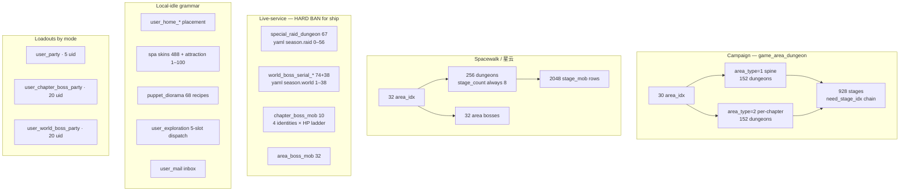
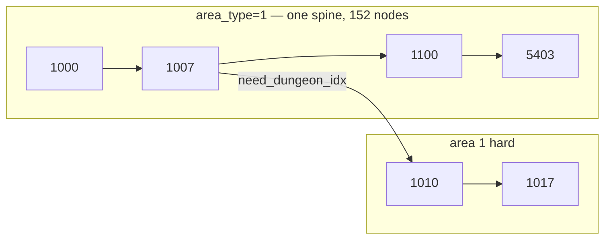

# Offline pack 1.1 — content loops (system shapes)

Source dump: `_sandbox/offline-pack-1.1/destinychild.sql` + `schema-only.sql` + `application.yaml`.
Pack notes: `单机dc1.1整合包/1.1教程.txt`, `更新日志.txt`.
Inventory: [`00-pack-inventory.md`](00-pack-inventory.md).

This file is **reference only**. It describes **counts and graphs**, not a remake checklist.

**Hard bans**

- Do not copy original names, art, `pck`, APK, jar, or SQL rows into `F:\Resonance\client`.
- Do not decompile APK / `pck` / jar. Story scripts, shop SKUs, and gacha banners are **absent** from this dump and must stay that way.
- Do not list original stage titles. Two **id-only** structural examples appear below; nothing else.

All `user_*` / `do_*` tables in the dump have **zero INSERT rows**. Runtime save lives in MySQL after the private server starts. `area_dungeon_clear` has one leftover row (not a master catalog).

---

## 0. Loop map (what the dump actually contains)



| Loop | Master rows | Player table (empty in dump) | Shipped Resonance |
|---|---|---|---|
| Campaign chain | 304 dungeons + 928 stages | `area_dungeon_clear` (1 leftover) | **Reuse grammar**, original chapters only |
| Spacewalk corridor | 256 + 2048 + 32 bosses | `user_spacewalk_area_dungeon` | Optional later; same grammar, not 2048 original floors |
| Raid seasons | 67 | — (jar) | **Never ship** |
| World-boss seasons | 74 + 38 | `user_world_boss_party` | **Never ship** seasons/ranking |
| Chapter-boss ladder | 10 | `user_chapter_boss_party` | Later: **one local boss**, no seasons |
| Area boss | 32 | (spacewalk clear flag) | Later: **one local area-end fight** |
| Home / spa / diorama / dispatch / mail | see §5 | `user_home_*` `user_spa_*` `user_puppet_diorama` `user_exploration` `user_mail` | Optional local idle; **no shop/mail bus** |
| Party | schema only | three party tables | **5-man** presets OK; 20-uid raid desks are live-service |

---

## 1. Story / campaign

Tables: `game_area_dungeon` **304**, `game_area_dungeon_stage` **928**.

### 1.1 Dungeon catalog

| Field | Dump fact |
|---|---|
| `area_idx` | **30** values, `1`–`30` |
| `area_type` | **152 / 152** split on `1` vs `2` (normal vs hard **hypothesis**, mirrored ids) |
| `dungeon_type` | `1`=**228**, `3`=**56**, `2`=**20** |
| `stage_count` | `4`=**160**, `2`=**144** (not “always 4”) |
| `need_dungeon_idx` | empty/`0` on **exactly one** row (the opener) |
| `need_user_level` | **always `1`** in this dump (chain is the real gate, or the pack flattened it) |
| `area_gift_type` | `0` on 200 rows; remainder `2/3/4/6/7` as sparse chapter gifts |
| `view_idx` | 148 unique vs 304 rows (hard often reuses a `_02` variant of the same view family) |

`stage_count` on the dungeon row **matches** actual stage INSERT count (0 mismatches). 160×4 + 144×2 = **928**.

**Chapter size is not uniform**

| Areas | Dungeons / area | Mix | Stages / dungeon |
|---|---|---|---|
| 1–8 | **16** (8 normal + 8 hard) | types 1+2+3 | **4** |
| 9–12 | **8** (4+4) | type 1 only | **4** |
| 13–30 | **8** (4+4) | type 1 only | **2** |

So: 8×16×4 + 4×8×4 + 18×8×2 = 512 + 128 + 288 = **928**.

`dungeon_type` 2 and 3 exist **only** in areas 1–8 and always carry `stage_count=4`. From area 9 onward the catalog is type-1 only. Treat type 1 as the default encounter node; types 2/3 as early-chapter variety nodes — **not** as original location names.

Crosstab `area_type × dungeon_type` is symmetric (hard is a clone of normal’s type mix): `(1,1)=114`, `(1,2)=10`, `(1,3)=28`, and the same three counts again on `area_type=2`.

Id scheme (no titles): area `A` normal uses `{1000 + decade(A) + 0..n}`, hard uses the same block **+10**. Decade gaps exist (no campaign `1800`/`1900`; raid rows still *point* at those missing ids — dangling live-service hooks).

### 1.2 Unlock graph



- **Normal (`area_type=1`)**: a **single linear spine of 152**. Area `K+1` first node needs area `K` last node (`1100` needs `1007`, `1200` needs `1107`, … `5400` needs `5303`). One root: `1000` / `need=0`.
- **Hard (`area_type=2`)**: **30 separate chains** (one per `area_idx`). Each chapter’s hard opener needs **that chapter’s last normal**, not the previous hard (`1010` needs `1007`, `1110` needs `1107`). Hard does **not** form a 152-long spine of its own.
- Within a chain, `need_dungeon_idx` is 1-parent, 1-child (no branches in this dump).

This is the grammar Resonance may copy: **chapter → linear dungeon list → optional second difficulty gated on that chapter’s clear**. Not 30 original chapters.

### 1.3 Stage graph

Each dungeon is itself a linear `need_stage_idx` chain.

| Field | Dump fact |
|---|---|
| Stages / dungeon | **4** on 160 dungeons, **2** on 144 |
| Chain integrity | 0 broken `need_stage_idx`; 1 root per dungeon; 0 multi-child |
| `is_boss_stage` | **304 = one per dungeon**, always the **last** node |
| `phase_count` | **3** on 924 stages; **1** on 2; **2** on 2 (the opener dungeon only) |
| `start_stamina` | **always 1** |
| `end_stamina` | areas 1–8: values **1–17** (64 stages/area); areas 9–30: **24** on normal, **29** on hard (208+208) |
| Enemy preview | schema has **6** `show_char_*` slots; **3 filled** on 924 stages, **2 filled** on 4 opener stages |
| Preview `is_boss` flags | 176 stages mark ≥1 preview slot as boss (optional; weaker than `is_boss_stage`) |

There is **no separate campaign mob table** in this dump. Preview identity / grade / level / awaken live **on the stage row**. Real battle waves are not in SQL (jar / client). `phase_count=3` is the usual “waves in one fight” flag.

**Structural example 1 (ids only, opener).** Dungeon `1000`: `area_idx=1`, `area_type=1`, `dungeon_type=2`, `stage_count=4`, `need_dungeon_idx=0`. Stages `100001 → 100002 → 100003 → 100004` with `is_boss_stage` only on `100004`. Phases `1,1,2,2` (the only non-3 phases in the dump). Two preview slots. This is the graph’s unique root — do not ship its title or art.

**Structural example 2 (ids only, hard gate).** Dungeon `1010` is the hard twin of the same chapter (`area_type=2`) and `need_dungeon_idx=1007` (last normal of area 1). Same 4-stage encoding (`101001`… pattern). That is the **per-chapter hard unlock** shape.

Stage id encoding: `{dungeon_idx}{01..04}` (or `01..02` later). Spacewalk uses the **same numeric pattern** with `01..08` — different table, do not join them.

`area_dungeon_clear` leftover: `idx=1000`, `star_count=3`, `is_clear=1`. Implies a **3-star** clear grammar exists in the client/jar even though this dump is not a star catalog.

### 1.4 Resonance

- **Reuse:** area → chained dungeons → chained stages; last stage = boss; optional second difficulty; 3-wave fights; 3–5 enemy preview portraits; 5-man party.
- **Do not ship:** original titles, `view_idx` strings, 304-row clone, stamina numbers as original economy, `area_gift_type` as original gift table, raid pointers into missing `18xx` ids.

---

## 2. Spacewalk / 星云

Changelog 1.1: 「星云普通关卡修复，可以尽情打一千多关」. SQL matches: **256 × 8 = 2048**.

| Table | Rows | Shape |
|---|---|---|
| `game_spacewalk_area_dungeon` | **256** | `dungeon_idx`, `stage_count`, `need_dungeon_idx`, `area_idx` |
| `game_spacewalk_area_dungeon_stage_mob` | **2048** | 1 row per stage; PK `(stage_idx, dungeon_idx)` |
| `game_spacewalk_area_boss_mob` | **32** | PK `area_idx`; one boss per area |
| `user_spacewalk_area_dungeon` | 0 INSERTs | `is_area_boss_clear`, `last_clear_dungeon_idx`, `last_clear_stage_idx`, `is_reward_get` |

### 2.1 Dungeon graph

- **32** areas, **always 8 dungeons each**, **always `stage_count=8`**.
- One global spine: only dungeon `1000` has `need_dungeon_idx=0`. Area `K+1` first node needs area `K` last (`1100` needs `1007`, … `4700` needs `4607`). No branches.
- **No** `area_type`, **no** `dungeon_type`, **no** stamina columns, **no** 6-char preview/reward fields on the dungeon row.

Id decades differ from campaign after the early block (spacewalk keeps 8-wide chapters through area 32 ending at `4707`; campaign compresses later areas and stops at 30). **132** numeric `dungeon_idx` values overlap the campaign table. They are **different entities in different tables** — never join on id.

### 2.2 Stage mobs vs campaign stages

| | Campaign stage | Spacewalk stage_mob |
|---|---|---|
| Rows | 928 | **2048** |
| Waves (`phase`) | almost always **3** | **always 1** |
| Formation | 6 preview slots, usually 3 filled | **5 positions, always all filled** |
| Extra | stamina, rewards, `is_boss_stage`, grades | `enemy_buff_1..3` (3/2/1 buffs on 1480/112/456 rows) |
| Boss mark | last stage of each dungeon | **area** boss table, 1 position + 3 buffs, `phase=1` |

`stage_idx` is unique across all 2048 rows (`100001`…`100008` per dungeon, then `100101`…). Changelog’s “one thousand plus stages” is this table, not campaign.

Area boss: 32 rows, one filled position (solo face), 3 buffs. `area_boss_mob` (also 32) is a **different** 5-skill catalog (see §3); spacewalk’s own boss row is `game_spacewalk_area_boss_mob`.

### 2.3 Resonance

Spacewalk is a **simpler, longer corridor** of the campaign grammar: area → 8 dungeons → 8 one-phase fights → area boss. Reuse as an optional local “endless chapter” **with original floors**, not 32×8 original maps. Do not ship 2048 original encounters.

---

## 3. Raid / world boss / chapter boss / area boss — live-service

These tables are **seasonal catalogs**. `application.yaml` selects the live season **without restarting the game client** (changelog item 9: edit yaml, restart the Spring jar).

```yaml
season:
  raid: 49        # comment: 0–56
  world: 27       # comment: 1–38
  level_max: 1    # 1 = rewards auto-max-level characters
```

Resonance **HARD BAN**: no events, ranking, raid seasons, world-boss seasons, or yaml season switches in the shipped product. No `raid_coin` / `world_boss_serial_coin` economy (`do_login` columns exist for those currencies).

### 3.1 `special_raid_dungeon` — 67 rows

| Fact | Value |
|---|---|
| `season_idx` | **0–56 complete** (57 seasons). yaml `49` is in range |
| `raid_type` | `1`=57, `2`=5, `3`=5 |
| `stage_count` | `50`×2, `40`×26, `30`×24, `1`×15 — these are **raid floors**, not campaign 4-stage nodes |
| Calendar | all 67 have `start_date` / `end_date` (2016–… windows) |
| Hooks | `normal_dungeon_idx` + `hard_dungeon_idx` filled on all 67 (theme/unlock pointers into campaign ids, including **missing** `1800`/`1900`) |
| Display | `display_vid_*`, `open_assistant_date`, `skill4` |

Seasons 51–56 grow extra rows: `raid_type` 2 and 3 with `stage_count=1` (single-fight variants beside the type-1 catalog). Rows per season: 51 seasons ×1, 2 seasons ×2, 4 seasons ×3.

**Never ship:** season index, date windows, assistant windows, ranking, raid shop.  
**Grammar that may be reused later (offline, one fight):** a boss with a floor count, a normal/hard pointer, a display vid slot — **one local entry**, not 57 rotating seasons.

### 3.2 World boss — `world_boss_serial_mob` 74 + `world_boss_serial_mob_data` 38

| Fact | Value |
|---|---|
| Seasons | **1–38 complete**. yaml `27` is in range |
| `*_mob` | 4 seasons (**1–4**) have **levels 1–10**; **34** later seasons have **one** level |
| `*_data` | **one row per season** (PK `season_idx`); `confim=1` on all 38; `level` is `1` (34) or `10` (4) |
| Presentation | `bg_key`, `display_vid`, 3 `enemy_buff_*`, 5 skills on `*_data` |

Early seasons = buff/bg **ladder** across 10 levels. Later seasons = single snapshot. This is a **live rotation**, not a campaign chapter.

**Never ship:** season switch, serial ladder as a ranked world event, `world_boss_serial_coin`.  
**Later local grammar:** one boss, optional HP/buff steps, 5-skill kit. No season `idx`.

### 3.3 `chapter_boss_mob` — 10 rows

Ids: `101–104`, `201–203`, `301–302`, `401`.

- **4 identities**, not 30 campaign areas. Same `character_idx` / `view_idx` within a family.
- HP ladder (same family): ~4.6M → ~16M → ~41M → ~74M.
- `hp_phase=20` on all 10 (phase ticks / HP% steps).
- 3 enemy buffs + 5 skills on every row.

This is a **difficulty-stepped boss desk**, paired with `user_chapter_boss_party` (20 uid + `drive_skill_slots` — four 5-man desks). Live-service adjacent (multi-team raid), but the **mob row itself** is the cleanest “local boss with HP phases + buffs” template in the dump.

**Never ship:** 20-man raid desks, ranking, original bosses.  
**Later:** one local fight, 5-man, HP phases, 3 buff slots.

### 3.4 `area_boss_mob` — 32 rows

`idx` 1–32, 32 unique `character_idx` / `view_idx`, 5 skills each. Count matches **spacewalk’s 32 areas**, not campaign’s 30. Distinct from `game_spacewalk_area_boss_mob` (formation+buffs vs full skill kit).

**Later:** area-end solo face. **Never:** original 32 faces as a seasonal checklist.

### 3.5 Ship vs later vs never

| Grammar | Later local OK? | Shipped MVP? | Never |
|---|---|---|---|
| Linear chapter chain + last-stage boss | yes | **yes** (tiny original chain) | original 304 |
| Second difficulty gated on chapter clear | yes | optional | original hard titles |
| Long corridor + area-end boss | yes | no | 2048 original floors |
| HP-phase boss + 3 buffs + 5 skills | yes | no | seasons / ranking |
| 10-level serial ladder | only as a local practice dummy | no | world-boss seasons |
| Calendar `start_date`/`end_date`, yaml `season.*` | no | no | **HARD BAN** |
| Raid floors 30–50 + assistant windows | no | no | **HARD BAN** |

---

## 4. Home / spa / diorama / exploration / mail

Idle and lobby loops. Player tables are empty schemas; master data exists for spa skins, spa stat%, and diorama recipes.

### 4.1 Home — `user_home_*`

| Table | Shape |
|---|---|
| `user_home_info_data` | background, lobby BGM, brightness, `is_spa`, `spa_area_idx` |
| `user_home_character_slot` | place a character: `user_x/y`, `zoom_offset_*`, `zoom_scale` |
| `user_home_sticker_slot` | sticker `idx` + `x/y/scale` |
| `user_home_edit_info` | `bgm`, `effect`, two extra uids |

Grammar: **lobby as a placed scene**, not a battle loop. Resonance may keep a local home layout. Do not ship original backgrounds / stickers.

### 4.2 Spa

| Table | Rows / shape |
|---|---|
| `character_spa_skin` | **488**. `type=0/sub_type=1` = 482; `type=2/sub_type=0` = 6. All 488 `idx` exist in `characters`; **149** characters have no spa skin |
| `character_spa_status_percent` | **240** = attraction×grade: grade3→**60**, grade4→**80**, grade5→**100** |
| `user_spa_enter_child` | soak slot: character + present/melt items + `startTS`/`endTS` + heart-reward cursor |
| `user_spa_decoration` / `user_spa_child_decoration` | placed items: `x/y/scale/flip` |
| `user_character` flags | `spa_view_idx`, `attraction_level/exp`, `bathing_hour`, `is_spa_enter`, `is_spa_view_open` |

Grammar: **idle timer + affection level → stat%**, plus a spa-only view. Currency column `spa_coin` on `do_login` is live-service shop fuel — **do not ship**. A later local “rest / bond” loop may use a timer and a 1–N affection curve **on original units only**.

### 4.3 Diorama — `puppet_diorama` 68 + `user_puppet_diorama`

Master: 68 recipes, `group_idx` 1/2/3 = 18/28/22, `grade` 1–5 = 20/19/16/10/3. Every recipe has `skill_idx`. Five slots are **constraint templates** (`slotN_type` / `slotN_grade`); `slotN_idx` is empty on 67/68 recipes (one recipe fills 4). `enable_date` is all-zero in this dump (the live-service date gate is still on the schema).

Player: five `item*_uid` fills. `user_item.equip_diorama_idx` ties a puppet item to a recipe.

Grammar: **5-slot set bonus**. Resonance may later do original set recipes. Do not ship 68 original dioramas or `enable_date` as an event gate. Puppet master is 253 + 356 skills (see inventory) — collection, not a battle chapter.

### 4.4 Exploration — `user_exploration`

5 dispatch uids (`uid1`–`uid5`), `state`, `explorationEndTS`, `immediateEndTS`, `immediate_finish_count`, `stage_idx`. `user_character.is_exploration` flags a unit as busy. Schema `AUTO_INCREMENT=2` with no INSERTs.

Grammar: **5-slot idle dispatch**. Later local OK. Do not ship skip-tickets-as-IAP or original dispatch maps. Changelog “infinite tickets” must not become a product feature (see §6).

### 4.5 Mail — `user_mail`

Inbox: `reward_idx/type/count`, `is_receive_reward`, `expireTS` / `showTS` / `receiveTS`, `title` / `text` / `reason`. Changelog: 血石商店无限购买 → **领取在邮件**. Shop SKU tables are **not in this dump** (jar). Mail here is a **delivery bus**, not a content loop.

Resonance: **no shop, no mail-as-shop**. Local rewards go straight to inventory.

---

## 5. Party loadouts by mode

| Table | Slots | Extra | Mode |
|---|---|---|---|
| `user_party` | **uid1–uid5** + `leader_uid` | PK `(nfguid, idx)` → multiple presets | default / campaign |
| `user_chapter_boss_party` | **uid1–uid20** + `leader_uid` | `drive_skill_slots` | chapter-boss desk |
| `user_world_boss_party` | **uid1–uid20** + `leader_uid` | `drive_skill_slots` | world-boss desk |
| `user_exploration` | uid1–uid5 | timers | dispatch, not a fight desk |

20 uid = **four 5-man teams** sharing one Drive-skill bar. That is raid-scale, not MVP.

Resonance: ship **one 5-man party** (already in the vertical slice). Multiple named 5-man presets are fine. Do not ship 20-uid raid desks, Drive-slot raid UI, or per-season party lockouts.

---

## 6. Changelog cheats — server-side, not product

From `更新日志.txt` + yaml + dump flattening:

| Claim | Where it lives | Product |
|---|---|---|
| Infinite child / equip / puppet tickets | jar, not a master table | **MUST NOT** |
| Bloodstone shop unlimited; goods arrive in **mail** | jar + `user_mail` bus; no shop table in dump | **MUST NOT** (no shop) |
| 100% revival → first 5★ in the revive slot | jar | **MUST NOT** |
| RAID / WB season switch via yaml, restart server only | `season.raid` / `season.world` | **MUST NOT** (no seasons) |
| GM 5★ weapons | jar and/or extra `item` rows | **MUST NOT** |
| `level_max: 1` auto-max-level on gained characters | yaml | **MUST NOT** |
| Equip / skill-set bugfixes | jar | irrelevant to Resonance |
| Save persists if DB not dropped | MySQL `user_*` | Resonance uses **local save**, not this DB |
| `need_user_level` always 1 | dump | do not copy as “everything unlocked” |

These are private-server conveniences. Copying them into the Unity MVP would be cheat-as-design.

---

## 7. What this dump does *not* contain (do not go looking in the jar)

No gacha banner tables, no shop SKUs, no story script tables, no PvP match tables, no raid ranking tables. Campaign **enemy AI / skill formulas** are not in `game_area_dungeon_stage` (preview only). `skill_effect_path` is a VFX path index, not a content loop.

`battle_type` (84 rows) is an effectiveness map, not a mode catalog.

---

## 8. Clean-room takeaway for Resonance

1. **MVP content loop** = a short **original** chapter chain: dungeon list, stage chain, last node boss, 3 phases, 5-man party. Optional second difficulty gated on that chapter.
2. **Do not clone counts.** 30×(8 or 16) campaign nodes and 32×8×8 spacewalk nodes are original-IP volume.
3. **Live-service tables are a ban list**, not a backlog: raid 67, world-boss 38 seasons, yaml season keys, calendar windows, 20-uid desks, coin types, mail-shop.
4. **Reusable later (still original units, still offline):** HP-phase local boss; area-end single face; 5-slot dispatch; lobby placement; affection/timer; 5-slot set bonus.
5. **Never write original names or `view_idx` into `F:\Resonance\client`.**
